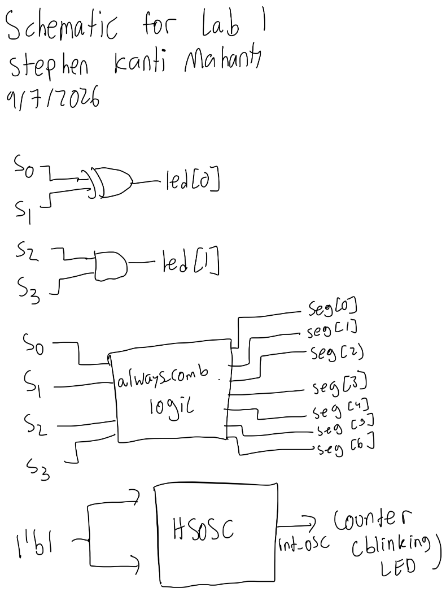
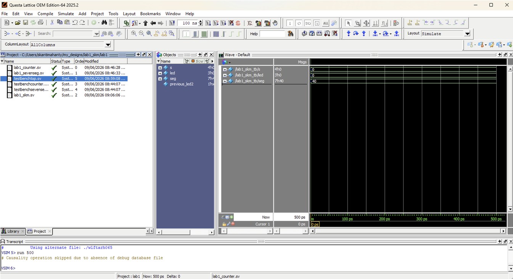
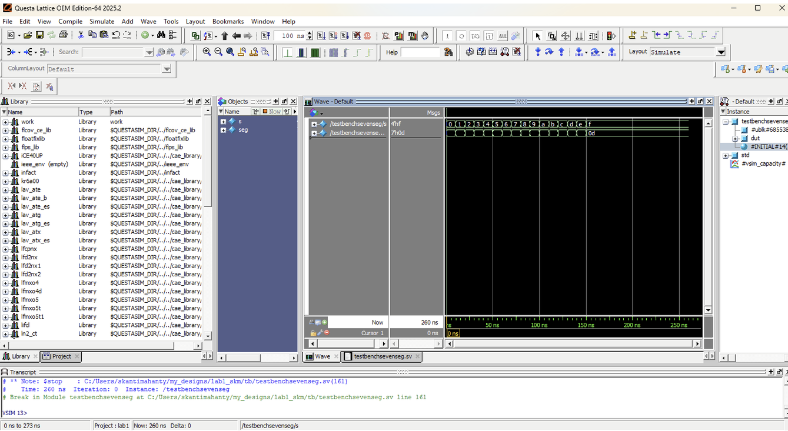

::: {.callout-tip title="Annotated Report Template"}
The following is the lab report for lab 1 for Stephen Kanti Mahanty.
:::

## Introduction

::: {.callout-note title="Introduction"}
Soldering and testing the FPGA board.
:::

In this lab, a design was implemented on the FPGA to demonstrate the functionality of the on-board high-speed oscillator by blinking one of the on-board LEDs. The high speed oscillator was configured at a frequency of 24 MHz and divided down using a counter to achieve a blinking frequency of \~2.4 Hz. A design was also implemented on the FPGA to configure a seven-segment display using four switches to display a number from 0 to 15. Finally, there were 2 LEDs enabled by switch logic that turn on and off depending on the state of the switches. All designes were tested using a testbench simulation in Questa. The design was then synthesized and implemented on the FPGA board.

## Design and Testing Methodology

::: {.callout-note title="Design and Testing Methodology"}
Explaining how I approached the design of this assignment from both a software and a hardware standpoint (as appropriate). Include how I tested your design.
:::

The on-board high-speed oscillator (`HSOSC`) from the iCE40 UltraPlus primitive library was used to generate a clock signal at 24 MHz. Then, a counter was used to divide the high frequency clock signal down so that the blinking frequency could be easily visualized using one of the on-board LEDs. The design was developed using a simple clock divider module which drives the external LED.

The hardware was soldered through a series of steps to ensure that the FPGA board was functioning correctly. The LEDs were verified to be functioning as expected. The seven-segment display circuit was designed using a set of resistors that limited the current to the display. The power and connections to the FPGA was done through a breadboard connector and a ribbon cable.

To design the two LEDs controlled by switches, the given truth table was analyzed to determine the logic connecting the switches to the LEDs. The logic was implemented using a simple combinational logic circuit. The design was then tested using a testbench simulation in QuestaSim to verify that the LEDs turned on and off as expected based on the state of the switches.

To design the software for the seven-segment display, the datasheets were analyzed and a seven-segment decoder was added. The idea is that the four switches comprise of the four bits of a binary number, and the seven-segment decoder converts that binary number into the appropriate signals to drive the seven-segment display. The design was then tested using a testbench simulation in QuestaSim to verify that the correct numbers were displayed on the seven-segment display based on the state of the switches.


## Technical Documentation:

::: {.callout-note title="Technical Documentation"}
Includes the link to a Git repository with the Verilog code, a block diagram of the design, and schematics of the circuits.
:::

The source code for the project can be found in the associated [Github repository](https://github.com/StephenTheCoder/ENGR155-Lab1).

### Block Diagram

::: {#fig-block-diagram}


Block diagram of the Verilog design.
:::

The block diagram in @fig-block-diagram demonstrates the overall architecture of the design. The design consists of a block connected to the seven-segment dispaly and resistors connecting the seven-segment LEDs to the FPGA.

### Schematic

::: {#fig-schematic}


Schematic of the physical circuit.
:::

@fig-schematic shows the physical layout of the design. It shows logic gates and connections between all the inputs and outputs.

## Results and Discussion

::: {.callout-note title="Results and Discussion"}
Did you accomplish all of the prescribed tasks? If not, what are the shortcomings? How might you address them given more time? As appropriate, how did the design perform (e.g., How fast/accurate/reliable was it?).
:::

I did accomplish all of the prescribed tasks. The design successfully blinked an external LED using the on-board high-speed oscillator. The design also successfully displayed numbers from 0 to 15 on the seven-segment display based on the state of the four switches. The two LEDs controlled by switches also functioned as expected based on the truth table provided.

Given more time, I would have liked to implement a more sophisticated counter to allow for a more precise output frequency. I would also want to add a second seven-segment display to display more numbers if I can. The current design only allows for the clock to be divided by powers of two, which limits the flexibility of the design. The design is still fast 

### Testbench Simulation

::: {#fig-testbench-top}


::: {#fig-testbench-counter}


::: {#fig-testbench-seg}


(Top) Screenshot of the QuestaSim simulation for the top-level module. (Middle) Screenshot of the QuestaSim simulation for the counter module. (Bottom) Screenshot of the QuestaSim simulation for the seven-segment display module.
:::

The design met all intended design objectives. @fig-testbench-top shows a screenshot of the top-level QuestaSim simulation. If a more precise output frequency was desired, a more sophisticated counter could be developed. The current design only allows for the clock to be divided by powers of two.

## Conclusion

::: {.callout-note title="Conclusion"}
Briefly summarize what was done and how it performed. Also note how many hours you spent working on the lab.
:::

The design successfully blinked an external LED using the on-board high-speed oscillator. I spent a total of twenty five hours working on this lab.

## AI Prototype Summary

I asked GPT 5.5 Medium. It gave out the following:

```
module blinky (
    output logic led
);

    // Internal 48 MHz high-frequency oscillator signal
    logic clk;

    // Enable the internal high-speed oscillator
    SB_HFOSC #(
        .CLKHF_DIV("0b00")   // 48 MHz output
    ) hfosc_inst (
        .CLKHFPU(1'b1),      // Power up oscillator
        .CLKHFEN(1'b1),      // Enable oscillator output
        .CLKHF(clk)
    );

    // For a 2 Hz blink:
    // LED toggles twice per full cycle, so toggle at 4 Hz.
    // 48 MHz / 4 = 12,000,000 cycles per toggle.
    localparam int unsigned MAX_COUNT = 12_000_000 - 1;

    logic [$clog2(MAX_COUNT + 1)-1:0] counter = '0;

    always_ff @(posedge clk) begin
        if (counter == MAX_COUNT) begin
            counter <= '0;
            led     <= ~led;
        end else begin
            counter <= counter + 1'b1;
        end
    end

endmodule
```