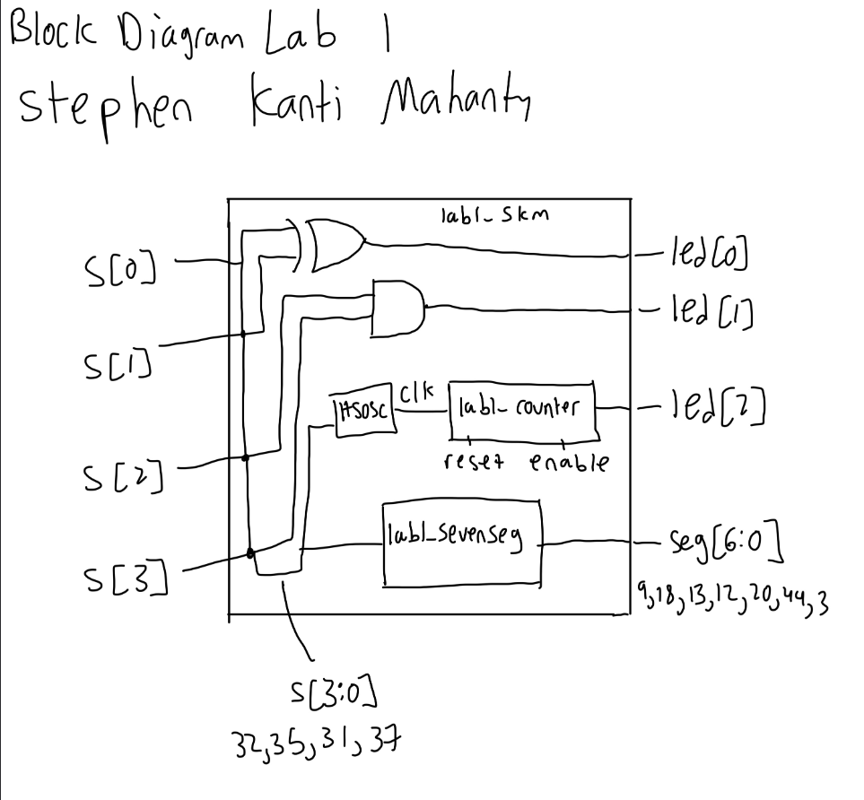
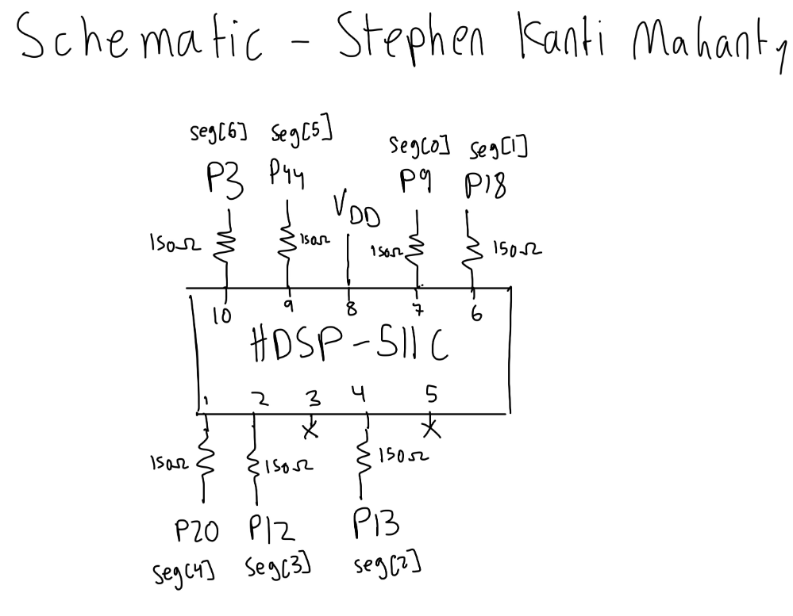
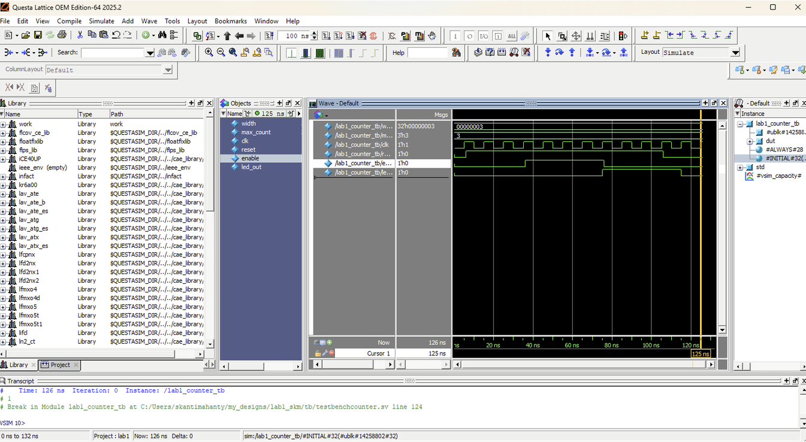

::: {.callout-tip title="Annotated Report Template"}
The following is the lab report for lab 2 for Stephen Kanti Mahanty.
:::

## Introduction

::: {.callout-note title="Introduction"}
Setting up a dual Multiplexed Seven-Segment Display and a Keypad Scanner.
:::

In this lab, a design was implemented on the FPGA to demonstrate the functionality of multiplexing seven-segment displays and scanning a keypad. The multiplexer was used to control two seven-segment displays, allowing them to display different numbers based on the state of the switches. Each display's switches functioned independently and switched at a predetermined rate. The keypad scanner was implemented to read input from a 4x4 matrix keypad and display the pressed column on four LEDs.

## Design and Testing Methodology

::: {.callout-note title="Design and Testing Methodology"}
Explaining how I approached the design of this assignment from both a software and a hardware standpoint (as appropriate). Include how I tested your design.
:::

The on-board high-speed oscillator (`HSOSC`) from the iCE40 UltraPlus primitive library was used to generate a clock signal at 24 MHz. Then, a counter was used to divide the high frequency clock signal down so that the blinking frequency could be easily visualized using one of the on-board LEDs. The design was developed using a simple clock divider module which drives the external LED.

For the keypad scanner, I made sure to use 120 Hz as my frequency since the switching rate is not too fast that the digits bleed but not too slow that the human eye can notice the switching.

To calculate this value and the maximum count, the following formula was used:
$$ f_{out} = \frac{f_{HSOSC}}{\text{max\_count}} = \dfrac{24000000}{200000} = 120 \text{Hz} $$

Where $f_{out}$ is the desired output frequency, $f_{in}$ is the input frequency, and max_count is the maximum count value for the counter. The maximum count value was calculated to be 199,999 such that this equation works (as counter starts from 0).

For the keypad scanner, each row had to blink at 2 Hz, so the clock frequency was set to be 8 Hz to sweep all four rows.

To calculate this value and the maximum count, the following formula was used:
$$ f_{out} = \frac{f_{HSOSC}}{\text{max\_count}} = \dfrac{24000000}{3000000} = 8 \text{Hz} $$

Where $f_{out}$ is the desired output frequency, $f_{in}$ is the input frequency, and max_count is the maximum count value for the counter. The maximum count value was calculated to be 2,999,999 such that this equation works (as counter starts from 0).

The hardware was soldered through a series of steps to ensure that the FPGA board was functioning correctly. The LEDs were verified to be functioning as expected. The seven-segment display circuit was designed using a set of resistors that limited the current to the display. Two breadboards were used to facilitate the connections and ensure that there are enough pins and that it looks good. Both switches and seven-segment display were tested to ensure proper functionality. The power and connections to the FPGA was done through a breadboard connector and a ribbon cable.

The resistor calculations for the seven-segment display are done through the PNP transistor datasheet. Knowing the saturation voltage (for the transistor to the common anode) is $0.4 V$, $V_{dd} = 3.3V$, $V_{f} = 2.0V$, and the sum of the currents is $I_{sum} = 50mA$, the resistor value is calculated as follows:

$$ \frac{V_{dd} - V_{sat} - V_{forward}}{R} * 7 = \frac{0.9 V}{R} * 7 = 50 mA $$

Which gives $R = 126 \Omega$. The closest stock value is 130 $\Omega$, which is what was used in the design.

The resistor calculations for the FPGA pins for the display are also using the same display. Knowing the voltage drop from the base to the collector is $0.95 V$ and $V_{dd} = 3.3V$, and we want $I = 5mA$, the resistor value is calculated as follows:

$$ R = \frac{3.3 V - 0.95 V}{5 mA} = \frac{2.35 V}{5 mA} = 470 \Omega $$

The closest stock value is 470 $\Omega$, which is what was used in the design.

For the keypad scanner, resistors were used for the transistors, the columns, and the LEDs. The resistors for the transistors were calculated using the same formula as above:

$$ R = \frac{3.3 V - 0.95 V}{5 mA} = \frac{2.35 V}{5 mA} = 470 \Omega $$

The closest stock value is 470 $\Omega$, which is what was used in the design.

The resistor for the column outputs was set to $R = 10 k\Omega$ to limit the current through the column lines. The resistors for the LEDs were set to $R = 330 \Omega$ to ensure that the LEDs operate within their safe current limits.

To design the two LEDs controlled by switches, the given truth table was analyzed to determine the logic connecting the switches to the LEDs. The logic was implemented using a simple combinational logic circuit. The design was then tested using a testbench simulation in QuestaSim to verify that the LEDs turned on and off as expected based on the state of the switches.

To design the software for the dual seven-segment display, the datasheets were analyzed and a seven-segment decoder was added. The idea is that the four switches comprise of the four bits of a binary number, and the seven-segment decoder converts that binary number into the appropriate signals to drive the seven-segment display. The design was then tested using a testbench simulation in QuestaSim to verify that the correct numbers were displayed on the seven-segment display based on the state of the switches.


## Technical Documentation:

::: {.callout-note title="Technical Documentation"}
Includes the link to a Git repository with the Verilog code, a block diagram of the design, and schematics of the circuits.
:::

The source code for the project can be found in the associated [Github repository](https://github.com/ENGR155/engr155-lab2/tree/main).

### Block Diagram

::: {#fig-block-diagram}
<details>
<summary>Click to reveal block diagram</summary>

</details>

Block diagram of the Verilog design.
:::

The block diagram in @fig-block-diagram demonstrates the overall architecture of the design. The design consists of a block connected to the seven-segment dispaly and resistors connecting the seven-segment LEDs to the FPGA.

### Schematic

::: {#fig-schematic}
<details>
<summary>Click to reveal schematic</summary>

</details>

Schematic of the physical circuit.
:::

@fig-schematic shows the physical layout of the design. It shows logic gates and connections between all the inputs and outputs. For the big block in the middle describing the seven-segment display, the full logic code is below, but it is pretty messy so I have it below:

## Results and Discussion

::: {.callout-note title="Results and Discussion"}
Did you accomplish all of the prescribed tasks? If not, what are the shortcomings? How might you address them given more time? As appropriate, how did the design perform (e.g., How fast/accurate/reliable was it?).
:::

I did accomplish all of the prescribed tasks. The design successfully multiplexed two seven-segment displays using the on-board high-speed oscillator. The design also successfully controlled LEDs from the keypad and was able to scan the rows at a rate of 2 Hz per row. 

Given more time, I would have liked to implement a more sophisticated counter to allow for a more precise output frequency for the multiplexing. I would also work with the keypad scanner to make it more accurate and reliable, especially with blinking the LEDs.

### Testbench Simulation

<details>
<summary>Click to reveal testbench</summary>

</details>

<details>
<summary>Click to reveal testbench</summary>

</details>

<details>
<summary>Click to reveal testbench</summary>

</details>


(Top) Screenshot of the QuestaSim simulation for the top-level module. (Middle) Screenshot of the QuestaSim simulation for the counter module. (Bottom) Screenshot of the QuestaSim simulation for the seven-segment display module.


The design met all intended design objectives. @fig-testbench-top shows a screenshot of the top-level QuestaSim simulation. If a more precise output frequency was desired, a more sophisticated counter could be developed. The current design only allows for the clock to be divided by powers of two.

## Conclusion

::: {.callout-note title="Conclusion"}
Briefly summarize what was done and how it performed. Also note how many hours you spent working on the lab.
:::

The design successfully multiplexed two seven-segment displays using the on-board high-speed oscillator. I spent a total of fifteen hours working on this lab.

## AI Prototype Summary

I asked Google's AI mode. It gave out the following:

<details>
<summary>Click to reveal spoiler</summary>

```
module tmux_seven_seg (
    input  logic       clk,      // System clock
    input  logic       rst_n,    // Active-low asynchronous reset
    input  logic [3:0] in0,      // First 4-bit input digit
    input  logic [3:0] in1,      // Second 4-bit input digit
    output logic [6:0] out0,     // Seven-segment output for digit 0 (Common Anode)
    output logic [6:0] out1      // Seven-segment output for digit 1 (Common Anode)
);

    // Internal signals
    logic       mux_sel;         // 0: decode in0, 1: decode in1
    logic [3:0] decoder_in;      // Selected input to the decoder
    logic [6:0] seg_decoded;     // Output of the single shared decoder

    // 1. Time-multiplexing control (alternates every clock cycle)
    always_ff @(posedge clk or negedge rst_n) begin
        if (!rst_n) begin
            mux_sel <= 1'b0;
        end else begin
            mux_sel <= ~mux_sel;
        end
    end

    // 2. Input multiplexer
    always_comb begin
        decoder_in = (mux_sel) ? in1 : in0;
    end

    // 3. Shared Seven-Segment Decoder Logic (Common Anode: 0 = ON, 1 = OFF)
    always_comb begin
        case (decoder_in)
            4'h0: seg_decoded = 7'b100_0000; // 0
            4'h1: seg_decoded = 7'b111_1001; // 1
            4'h2: seg_decoded = 7'b010_0100; // 2
            4'h3: seg_decoded = 7'b011_0000; // 3
            4'h4: seg_decoded = 7'b001_1001; // 4
            4'h5: seg_decoded = 7'b001_0010; // 5
            4'h6: seg_decoded = 7'b000_0010; // 6
            4'h7: seg_decoded = 7'b111_1000; // 7
            4'h8: seg_decoded = 7'b000_0000; // 8
            4'h9: seg_decoded = 7'b001_0000; // 9
            4'hA: seg_decoded = 7'b000_1000; // A
            4'hB: seg_decoded = 7'b000_0011; // b
            4'hC: seg_decoded = 7'b100_0110; // C
            4'hD: seg_decoded = 7'b010_0001; // d
            4'hE: seg_decoded = 7'b000_0110; // E
            4'hF: seg_decoded = 7'b000_1110; // F
            default: seg_decoded = 7'b111_1111; // All off
        endcase
    end

    // 4. Output Demultiplexing Registers
    // Captures and holds the decoded value for the respective display
    always_ff @(posedge clk or negedge rst_n) begin
        if (!rst_n) begin
            out0 <= 7'b111_1111; // All segments off
            out1 <= 7'b111_1111;
        end else begin
            if (mux_sel == 1'b0) begin
                out0 <= seg_decoded; // Store decoded in0
            end else begin
                out1 <= seg_decoded; // Store decoded in1
            end
        end
    end

endmodule
```

</details>

The second part is below:

<details>
<summary>Click to reveal spoiler</summary>

Here is the complete SystemVerilog HDL implementation to time-multiplex a single seven-segment decoder across two digits.

Design Architecture
To implement time multiplexing, the design follows this architecture:

   1. Clock Divider: Takes the 48 MHz clock from the HSOSC primitive and divides it down to a multiplexing frequency. A refresh rate of around 100 Hz to 1 kHz per digit is ideal to prevent visible flickering.
   2. Data Multiplexer: Selects between the two 4-bit data inputs (in0 and in1) based on the current state of the multiplexing clock.
   3. Seven-Segment Decoder: Decodes the selected 4-bit nibble into the 7-bit common-anode segment signals (seg).
   4. Digit Driver / Anode Control: Alternately enables the common anode pin for Digit 0 (anode0) and Digit 1 (anode1). Because it is a common-anode setup, driving an anode high (logic 1) powers that digit, while driving a cathode segment low (logic 0) illuminates the segment.


SystemVerilog Implementation## 1. The Top-Level Time-Multiplexed Module (top_mux_display.sv)

```
// top_mux_display.sv// Author: [Your Name]// Date: September 14, 2026// Purpose: Time-multiplexes a single 7-segment decoder to drive two common-anode digits.
module top_mux_display (
    input  logic [3:0] in0,     // 4-bit input for Digit 0
    input  logic [3:0] in1,     // 4-bit input for Digit 1
    input  logic       reset,   // Active-high system reset
    output logic [6:0] seg,     // 7-bit output for segments A-G (active-low)
    output logic       anode0,  // Common anode control for Digit 0 (active-high)
    output logic       anode1   // Common anode control for Digit 1 (active-high)
);

    // Internal signals
    logic clk_48m;              // 48 MHz internal clock from oscillator
    logic mux_clk;              // Slow clock for switching between digits
    logic [3:0] selected_nibble;// 4-bit data routed to the decoder
    
    // 1. Instantiate the Lattice iCE40 Internal Oscillator primitive
    // Generates a 48 MHz internal clock signal
    HSOSC #(.CLKHF_DIV("0b00")) osc_inst (
        .CLKHFPU(1'b1),
        .CLKHFEN(1'b1),
        .CLKHF(clk_48m)
    );

    // 2. Clock Divider for Mux Refresh Rate
    // 48 MHz / 2^16 = ~732 Hz refresh rate (perfect for preventing flicker)
    logic [15:0] clk_div;
    always_ff @(posedge clk_48m or posedge reset) begin
        if (reset)
            clk_div <= 16'b0;
        else
            clk_div <= clk_div + 1'b1;
    end
    
    // Use the MSB of the counter as our switching state flag
    assign mux_clk = clk_div[15];

    // 3. Data Multiplexer & Anode Controller
    // Alternates active digit and routes corresponding data to the shared decoder
    always_comb begin
        if (mux_clk == 1'b0) begin
            selected_nibble = in0;
            anode0         = 1'b1; // Turn on Digit 0
            anode1         = 1'b0; // Turn off Digit 1
        end else begin
            selected_nibble = in1;
            anode0         = 1'b0; // Turn off Digit 0
            anode1         = 1'b1; // Turn on Digit 1
        end
    end

    // 4. Shared Seven-Segment Decoder Instance
    // Decodes the currently selected 4-bit nibble to the 7-bit segment outputs
    sev_seg_decoder decoder_inst (
        .data(selected_nibble),
        .seg(seg)
    );
endmodule
```

2. The Core Submodule: Seven-Segment Decoder (sev_seg_decoder.sv)
This module maps a 4-bit hex value to the common-anode display mapping. Because it is common-anode, a bitwise 0 turns the segment ON and a 1 turns it OFF.

```
// sev_seg_decoder.sv// Author: [Your Name]// Purpose: Combinational 4-bit Hexadecimal to Common-Anode 7-Segment Decoder.// Mapping: seg[0]=A, seg[1]=B, seg[2]=C, seg[3]=D, seg[4]=E, seg[5]=F, seg[6]=G
module sev_seg_decoder (
    input  logic [3:0] data,   // 4-bit Hex input
    output logic [6:0] seg     // 7-bit output (Active-Low)
);

    always_comb begin
        case (data)
            //                    GFEDCBA
            4'h0: seg = 7'b1000000;
            4'h1: seg = 7'b1111001;
            4'h2: seg = 7'b0100100;
            4'h3: seg = 7'b0110000;
            4'h4: seg = 7'b0011001;
            4'h5: seg = 7'b0010010;
            4'h6: seg = 7'b0000010;
            4'h7: seg = 7'b1111000;
            4'h8: seg = 7'b0000000;
            4'h9: seg = 7'b0010000;
            4'hA: seg = 7'b0001000;
            4'hB: seg = 7'b0000011; // Lowercase 'b' to distinguish from '8'
            4'hC: seg = 7'b1000110;
            4'hD: seg = 7'b0100001; // Lowercase 'd' to distinguish from '0'
            4'hE: seg = 7'b0000110;
            4'hF: seg = 7'b0001110;
            default: seg = 7'b1111111; // All segments OFF
        endcase
    end
endmodule
```

Implementation Tips & Pin Rules for Lab 1

* Hardware Warning: Do not forget to connect a current-limiting resistor (typically 220Ω to 1kΩ) in series with each of your 7 cathode lines (seg[6:0]) before connecting them to the FPGA pins.
* Dual-Digit Handling: If you are using a two-digit layout like the MAN6410, ensure you locate both physical common-anode pins on the chip footprint and map them to your anode0 and anode1 output assignments in your Lattice Radiant constraints file.

If you want, let me know:

* Do you need a testbench (TB) script written to simulate this multiplexing logic inside ModelSim?
* Are you planning to drive the in0 and in1 inputs using physical board components (like the DIP switches or the MCU via SPI/UART)?

I can tailor the stimulus block or structural mapping exactly to match your project's next milestones!


</details>


The code was correct and worked fine in Radiant, and was able to synthesize properly. The quality of the output was good, and the code was well-structured and easy to understand. The code used a high-frequency oscillator to generate a clock signal, which was then divided down using a counter to achieve the desired blinking frequency for the LED. This is the same way that was used in the original design. Overall, the code was effective in achieving the desired functionality of blinking an LED at a specified frequency.

There were some new lines that were different from lab 1, but most of the logic and ideas is the same. Since this is a fast model, the deep thinking was not there and instead prioritized an output that might not be the most efficient. This still gave proper outputs and was able to synthesize properly. The code was also well-structured and easy to understand, which is important for future maintenance and debugging.

I think using an LLM to help me code is very useful, as I can analyze the code and learn from it whilst being more productive. I can also use it to help me debug my code, as it can point out errors and suggest fixes. Overall, I think using an LLM to help me code is a unique idea and I may plan to use it in the future. In the future, I will try to optimize my LLM output to conserve tokens whilst also making proper statements.