<!-- Recovered from published HTML at commit 74aecb388263b078a9a4d0da348c04b87e4c3259; original source formatting and unpublished content are unavailable. -->

::: {.callout-tip title="Annotated Report Template"}

The following is the lab report for lab 3 for Stephen Kanti Mahanty.

:::


## Introduction {#introduction}


::: {.callout-note title="Introduction"}

Setting up modular code that reads a 4x4 keypad and displays the last two digits on a dual seven-segment display.

:::


In this lab, a design was implemented on the FPGA to demonstrate the functionality of multiplexing seven-segment displays and collecting numbers from a keypad. The multiplexer was used to control two seven-segment displays, allowing them to display different numbers based on the state of the switches. Each display’s switches functioned independently and switched at a predetermined rate. The keypad scanner was implemented to read input from a 4x4 matrix keypad and display the pressed column on four LEDs. The pressed keys display on the seven-segment display, with the most recent key on the rightmost display.


## Design and Testing Methodology {#design-and-testing-methodology}


::: {.callout-note title="Design and Testing Methodology"}

Explaining how I approached the design of this assignment from both a software and a hardware standpoint (as appropriate). Include how I tested your design.

:::


The on-board high-speed oscillator (`HSOSC`) from the iCE40 UltraPlus primitive library was used to generate a clock signal at 24 MHz. Then, a counter was used to divide the high frequency clock signal down so that the blinking frequency could be easily visualized using one of the on-board LEDs. The design was developed using a simple clock divider module which drives the external LED.


All resistor calculations are the same from before. The important parts are the switching frequencies. The scanner frequency was set to 50 Hz to ensure that the scanner scans fast and that keypads could be pressed to deliver (pretty much) instantaneous speed to the display. The speed of the debouncer was set to be 4 ms since that is a common value of debouncing speed. The debouncer makes sure that any small change in the switch value gets negated. The FSMs are below

 

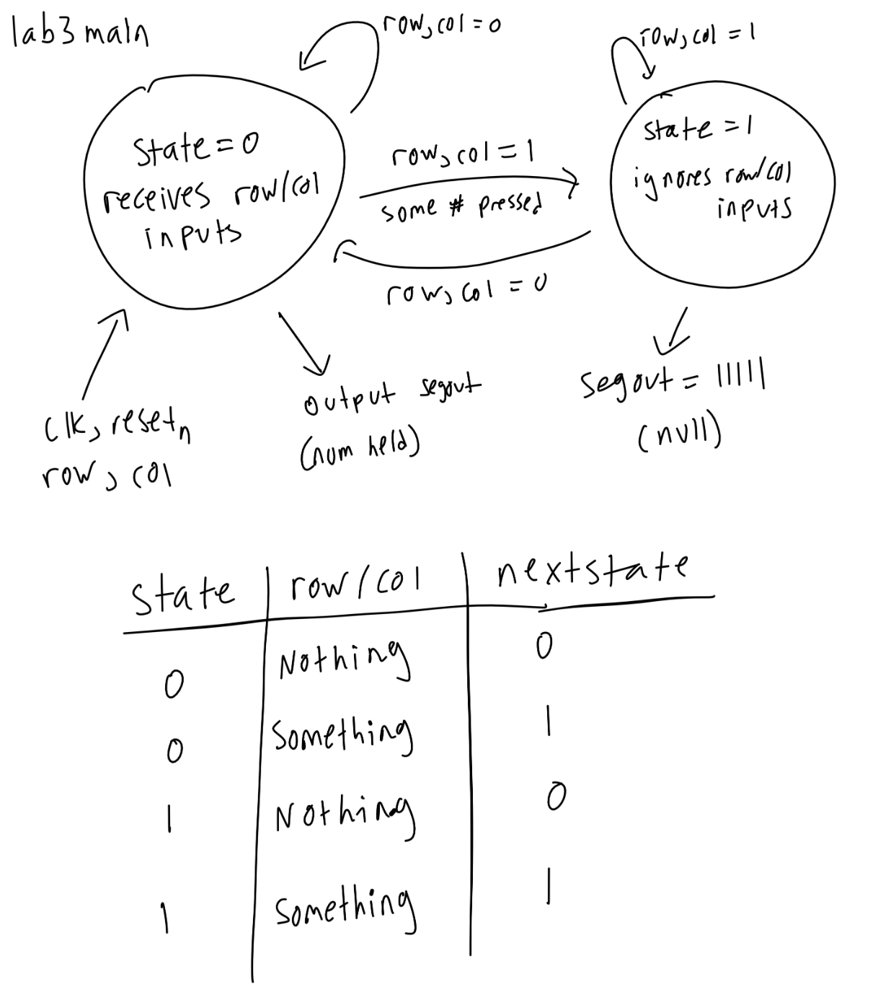

  

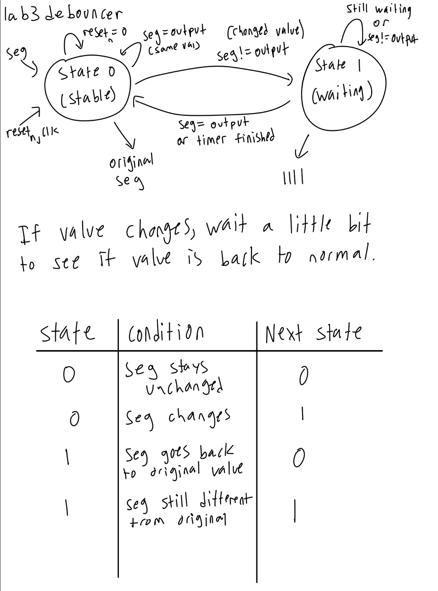

  

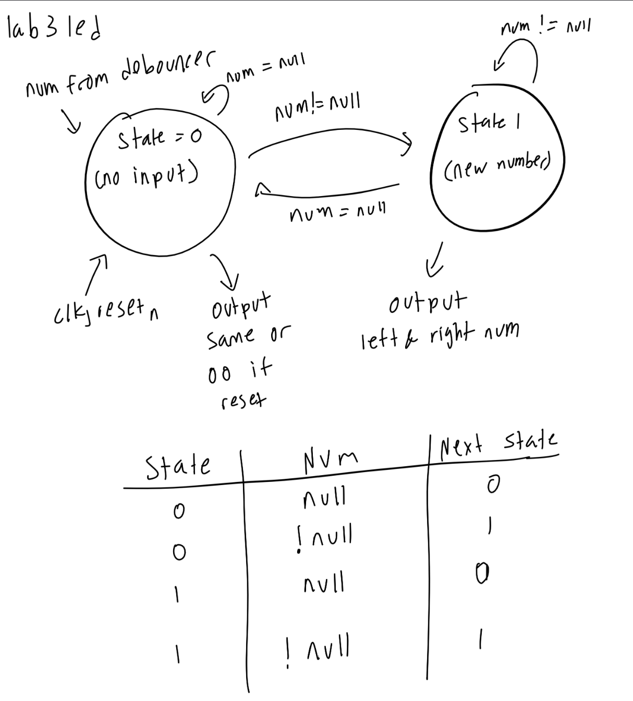

 

The design starts off with a synchronizer to synchronize rows and columns. This row and column value is sent to the decoder which collects the written keypad value and sends it to the debouncer. The debouncer works by starting a timer and making sure the number stays the same (if the number changes momentarily, the timer resets) and only outputs when the value is constant. The debouncer finally passes off this number to the seven-segment display, which stores the number and places it in the rightmost display. The design was then tested using a testbench simulation in QuestaSim to verify that the final output matched the initial keypresses.


Hardware was tested using physical displays, and was proven correct.


## Technical Documentation: {#technical-documentation}


::: {.callout-note title="Technical Documentation"}

Includes the link to a Git repository with the Verilog code, a block diagram of the design, and schematics of the circuits.

:::


The source code for the project can be found in the associated [Github repository](https://github.com/ENGR155/engr155-lab3/tree/main).


### Block Diagram {#block-diagram}

 

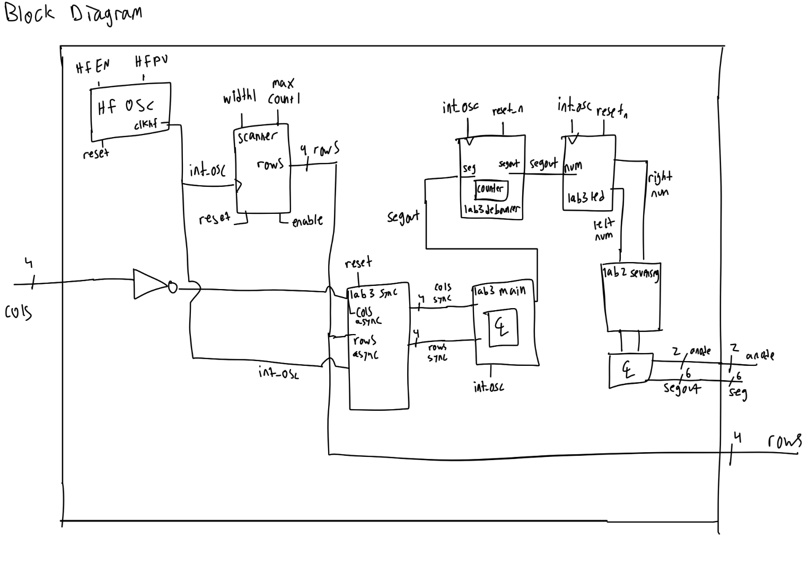

  

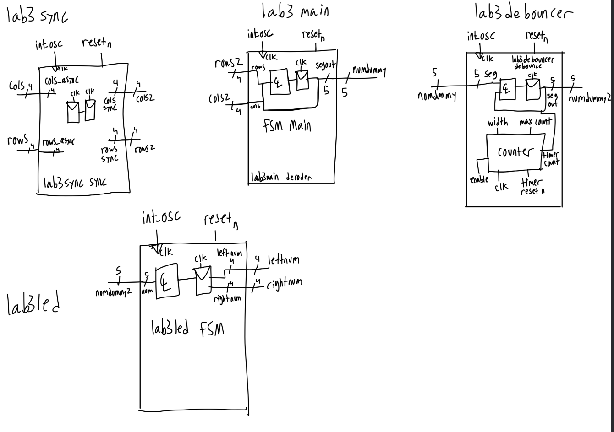

 

The block diagram in [Figure 4](#fig-block-diagram) demonstrates the overall architecture of the design. The design consists of a block connected to the seven-segment dispaly and resistors connecting the seven-segment LEDs to the FPGA. The block diagram in [Figure 5](#fig-block-diagram-2) expanded is a block diagram that expands upon the original block diagram and shows the in-depth look at each complicated module.


### Schematic {#schematic}

 

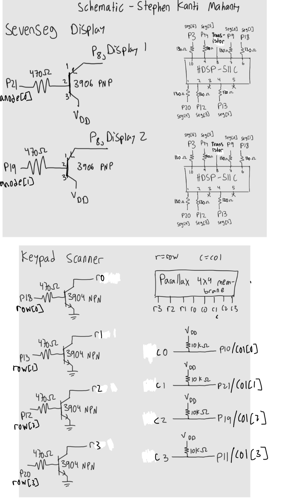

 

[Figure 6](#fig-schematic) shows the physical layout of the design. It shows logic gates and connections between all the inputs and outputs. It is very similar to the one in lab 2, but without switches and external LEDs.


## Results and Discussion {#results-and-discussion}


::: {.callout-note title="Results and Discussion"}

Did you accomplish all of the prescribed tasks? If not, what are the shortcomings? How might you address them given more time? As appropriate, how did the design perform (e.g., How fast/accurate/reliable was it?).

:::


I did accomplish all of the prescribed tasks. The design successfully multiplexed two seven-segment displays using the on-board high-speed oscillator. The design also successfully controlled LEDs from the keypad and was able to scan the rows at a rate of 50 Hz per row.


Given more time, I would have liked to implement a more sophisticated display that can have more than two segments, sort of like a microwave counter.


### Testbench Simulation {#testbench-simulation}


<details>
<summary>Click to reveal testbench</summary>

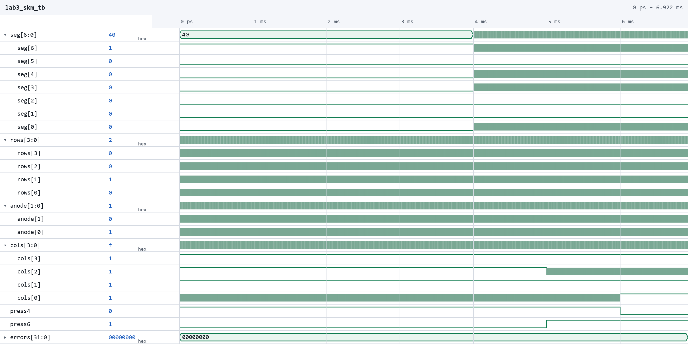

</details>


<details>
<summary>Click to reveal testbench</summary>

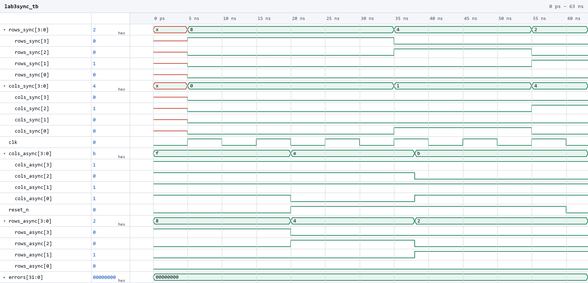

</details>


<details>
<summary>Click to reveal testbench</summary>

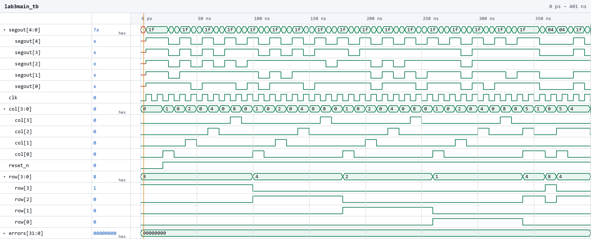

</details>


<details>
<summary>Click to reveal testbench</summary>

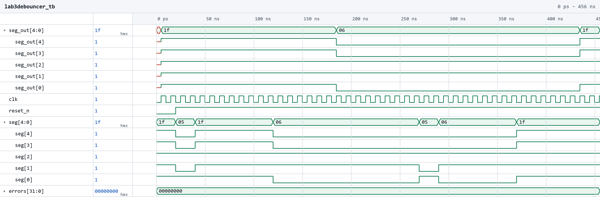

</details>


<details>
<summary>Click to reveal testbench</summary>

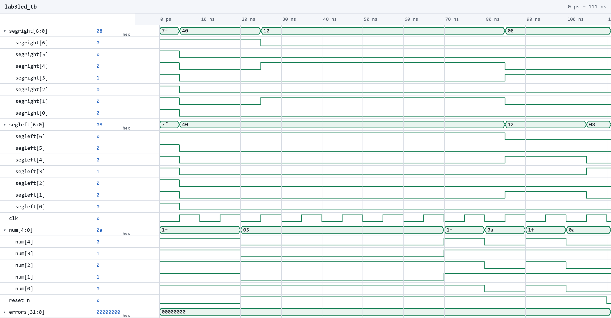

</details>


(Top) Screenshot of the QuestaSim simulation for the top-level module. (Second) Screenshot of the QuestaSim simulation for the synchronizer module. (Third) Screenshot of the QuestaSim simulation for the decoder module. (Fourth) Screenshot of the QuestaSim simulation for the debouncer module. (Bottom) Screenshot of the QuestaSim simulation for the LED module.


The design met all intended design objectives. **?@fig-testbench-top** shows a screenshot of the top-level QuestaSim simulation. If a more precise output frequency was desired, a more sophisticated counter could be developed.


## Conclusion {#conclusion}


::: {.callout-note title="Conclusion"}

Briefly summarize what was done and how it performed. Also note how many hours you spent working on the lab.

:::


The design successfully multiplexed two seven-segment displays using the on-board high-speed oscillator. I spent a total of 22-25 hours working on this lab.


## AI Prototype Summary {#ai-prototype-summary}


I asked Google’s Gemini. It gave out the following:


<details>
<summary>Click to reveal response</summary>

Below is a complete, modular, and fully synthesizable SystemVerilog implementation tailored for the Lattice iCE40 UP5K FPGA.

 

---

 

Module 1: Clock Divider

 

Generates narrow single-cycle pulse `tick` flags at desired target frequencies (100 Hz for scanning and 1 kHz for multiplexing) without generating gated clocks.

 

```systemverilog
// Generic Clock Divider generating single-cycle tick pulses
module clock_divider #(
    parameter int CLK_FREQ  = 20_000_000, // 20 MHz clock
    parameter int TICK_FREQ = 100         // Target pulse frequency in Hz
)(
    input  logic clk,
    input  logic rst_n,
    output logic tick
);
    localparam int COUNT_MAX = (CLK_FREQ / TICK_FREQ) - 1;
    localparam int WIDTH     = $clog2(COUNT_MAX + 1);

    logic [WIDTH-1:0] count;

    always_ff @(posedge clk or negedge rst_n) begin
        if (!rst_n) begin
            count <= '0;
            tick  <= 1'b0;
        end else begin
            if (count >= COUNT_MAX) begin
                count <= '0;
                tick  <= 1'b1;
            end else begin
                count <= count + 1'b1;
                tick  <= 1'b0;
            end
        end
    end
endmodule
```

 

---

 

Module 2: Keypad Scanner Controller

 

Iterates active-low columns at ~100 Hz (a 10 ms period naturally filters contact bounce). Once a key is detected, it triggers a 1-cycle `key_valid` pulse and transitions to `WAIT_RELEASE`. In `WAIT_RELEASE`, all columns are pulled low (`4'b0000`), forcing any held switch to keep `row_in` active until all keys are released.

 

```systemverilog
// 4x4 Matrix Keypad Scanner with Debounce-by-Design and Single-Key Registration
module keypad_scanner (
    input  logic       clk,
    input  logic       rst_n,
    input  logic       scan_tick,  // ~100–200 Hz enable tick
    input  logic [3:0] row_in,     // Active-low row inputs (pull-up enabled)
    output logic [3:0] col_out,    // Active-low column outputs
    output logic [3:0] key_code,   // 4-bit decoded hex value
    output logic       key_valid   // Single-clock pulse when key registered
);
    // 2-stage synchronizer for asynchronous row inputs
    logic [3:0] row_sync_1, row_sync;
    always_ff @(posedge clk or negedge rst_n) begin
        if (!rst_n) begin
            row_sync_1 <= 4'b1111;
            row_sync   <= 4'b1111;
        end else begin
            row_sync_1 <= row_in;
            row_sync   <= row_sync_1;
        end
    end

    // FSM State Definition
    typedef enum logic {
        STATE_SCAN         = 1'b0,
        STATE_WAIT_RELEASE = 1'b1
    } state_e;

    state_e state;
    logic [1:0] col_idx;

    // Output driver assignment
    always_comb begin
        if (state == STATE_WAIT_RELEASE)
            col_out = 4'b0000; // Pull all columns low to detect any held key
        else
            col_out = ~(4'b0001 << col_idx); // Drive active column low
    end

    // Key Matrix Decoding Function
    function automatic logic [3:0] decode_hex(input logic [1:0] col, input logic [3:0] row);
        case ({col, row})
            // Column 0
            6'b00_1110: decode_hex = 4'h1;
            6'b00_1101: decode_hex = 4'h4;
            6'b00_1011: decode_hex = 4'h7;
            6'b00_0111: decode_hex = 4'hE; // '*' key -> E

            // Column 1
            6'b01_1110: decode_hex = 4'h2;
            6'b01_1101: decode_hex = 4'h5;
            6'b01_1011: decode_hex = 4'h8;
            6'b01_0111: decode_hex = 4'h0;

            // Column 2
            6'b10_1110: decode_hex = 4'h3;
            6'b10_1101: decode_hex = 4'h6;
            6'b10_1011: decode_hex = 4'h9;
            6'b10_0111: decode_hex = 4'hF; // '#' key -> F

            // Column 3
            6'b11_1110: decode_hex = 4'hA;
            6'b11_1101: decode_hex = 4'hB;
            6'b11_1011: decode_hex = 4'hC;
            6'b11_0111: decode_hex = 4'hD;

            default:    decode_hex = 4'h0;
        endcase
    endfunction

    // FSM State Machine
    always_ff @(posedge clk or negedge rst_n) begin
        if (!rst_n) begin
            state     <= STATE_SCAN;
            col_idx   <= 2 me;
            key_code  <= 4'h0;
            key_valid <= 1'b0;
        end else begin
            key_valid <= 1'b0; // Default pulse low

            if (scan_tick) begin
                case (state)
                    STATE_SCAN: begin
                        if (row_sync != 4'b1111) begin
                            key_code  <= decode_hex(col_idx, row_sync);
                            key_valid <= 1'b1;
                            state     <= STATE_WAIT_RELEASE;
                        end else begin
                            col_idx   <= col_idx + 1'b1;
                        end
                    end

                    STATE_WAIT_RELEASE: begin
                        // Release check: true only when all matrix keys are unpressed
                        if (row_sync == 4'b1111) begin
                            state   <= STATE_SCAN;
                            col_idx <= 2'd0;
                        end
                    end
                endcase
            end
        end
    end
endmodule
```

 

---

 

Module 3: 7-Segment Decoder & Time-Multiplexer

 

Decodes hex values to active-low 7-segment patterns (`seg_out[6:0]` corresponding to segments `a` through `g`) and switches between digits at 1 kHz to eliminate flicker and balance LED brightness.

 

```systemverilog
// 7-Segment Hexadecimal Decoder
module seven_seg_decoder (
    input  logic [3:0] hex_digit,
    output logic [6:0] seg_out    // Active-low segments: {a, b, c, d, e, f, g}
);
    always_comb begin
        case (hex_digit)
            4'h0: seg_out = 7'b000_0001; // 0
            4'h1: seg_out = 7'b100_1111; // 1
            4'h2: seg_out = 7'b001_0010; // 2
            4'h3: seg_out = 7'b000_0110; // 3
            4'h4: seg_out = 7'b100_1100; // 4
            4 me: seg_out = 7'b010_0100; // 5
            4'h6: seg_out = 7'b010_0000; // 6
            4'h7: seg_out = 7'b000_1101; // 7
            4'h8: seg_out = 7'b000_0000; // 8
            4'h9: seg_out = 7'b000_0100; // 9
            4'hA: seg_out = 7'b000_1000; // A
            4'hB: seg_out = 7'b110_0000; // b
            4'hC: seg_out = 7'b011_0001; // C
            4'hD: seg_out = 7'b100_0010; // d
            4'hE: seg_out = 7'b011_0000; // E
            4'hF: seg_out = 7'b011_1000; // F
            default: seg_out = 7'b111_1111;
        endcase
    end
endmodule

// 2-Digit Display Time-Multiplexer
module display_multiplexer (
    input  logic       clk,
    input  logic       rst_n,
    input  logic       mux_tick,     // ~1 kHz multiplexing pulse
    input  logic [3:0] digit_old,    // Older key digit (Digit 1 - Left)
    input  logic [3:0] digit_new,    // Latest key digit (Digit 0 - Right)
    output logic [1:0] digit_sel,    // Active-low digit selector
    output logic [6:0] seg_out       // Active-low segment lines
);
    logic active_digit; // 0 = Digit 1 (old), 1 = Digit 0 (new)
    logic [3:0] current_hex;

    always_ff @(posedge clk or negedge rst_n) begin
        if (!rst_n) begin
            active_digit <= 1'b0;
        end else if (mux_tick) begin
            active_digit <= ~active_digit;
        end
    end

    always_comb begin
        if (active_digit == 1'b0) begin
            current_hex = digit_old;
            digit_sel   = 2'b10; // Select Left Digit
        end else begin
            current_hex = digit_new;
            digit_sel   = 2'b01; // Select Right Digit
        end
    end

    seven_seg_decoder u_decoder (
        .hex_digit (current_hex),
        .seg_out   (seg_out)
    );
endmodule
```

 

---

 

Top-Level Module

 

Combines the subsystems, shift register for key history, and an option to instantiate the Lattice iCE40 `SB_HFOSC` primitive.

 

```systemverilog
// Top Level Module for Keypad Reader & Display
module top_keypad_display #(
    parameter int CLK_FREQ  = 20_000_000, // Nominal system clock frequency
    parameter int SCAN_FREQ = 100,        // Keypad scan clock (~100 Hz)
    parameter int MUX_FREQ  = 1000        // Display refresh rate (~1 kHz)
)(
    input  logic       clk_in,     // External clock input (if SB_HFOSC not used)
    input  logic       rst_n,      // Active-low reset
    input  logic [3:0] row_in,     // Keypad active-low rows
    output logic [3:0] col_out,    // Keypad active-low columns
    output logic [1:0] digit_sel,  // Active-low digit enables
    output logic [6:0] seg_out     // Active-low segment outputs {a..g}
);
    logic sys_clk;
    assign sys_clk = clk_in;

    /*
     * Note: To use the iCE40 UP5K internal high-speed oscillator directly,
     * uncomment the following block and disconnect 'clk_in':
     *
     * SB_HFOSC #(
     *     .CLKHF_DIV("0b10") // "0b00"=48MHz, "0b01"=24MHz, "0b10"=12MHz, "0b11"=6MHz
     * ) u_hfosc (
     *     .CLKHFPU(1'b1),
     *     .CLKHFEN(1'b1),
     *     .CLKHF  (sys_clk)
     * );
     */

    logic scan_tick;
    logic mux_tick;

    logic [3:0] digit_old;
    logic [3:0] digit_new;

    logic [3:0] scanned_key;
    logic       key_valid;

    // Clock Dividers
    clock_divider #(.CLK_FREQ(CLK_FREQ), .TICK_FREQ(SCAN_FREQ)) u_clk_div_scan (
        .clk   (sys_clk),
        .rst_n (rst_n),
        .tick  (scan_tick)
    );

    clock_divider #(.CLK_FREQ(CLK_FREQ), .TICK_FREQ(MUX_FREQ)) u_clk_div_mux (
        .clk   (sys_clk),
        .rst_n (rst_n),
        .tick  (mux_tick)
    );

    // Keypad Scanner Instance
    keypad_scanner u_keypad_scanner (
        .clk       (sys_clk),
        .rst_n     (rst_n),
        .scan_tick (scan_tick),
        .row_in    (row_in),
        .col_out   (col_out),
        .key_code  (scanned_key),
        .key_valid (key_valid)
    );

    // Key History Shift Register
    always_ff @(posedge sys_clk or negedge rst_n) begin
        if (!rst_n) begin
            digit_old <= 4'h0;
            digit_new <= 4'h0;
        end else if (key_valid) begin
            digit_old <= digit_new;   // Shift current key to older digit
            digit_new <= scanned_key; // Register newly pressed key
        end
    end

    // Multiplexed Display Driver Instance
    display_multiplexer u_display_mux (
        .clk       (sys_clk),
        .rst_n     (rst_n),
        .mux_tick  (mux_tick),
        .digit_old (digit_old),
        .digit_new (digit_new),
        .digit_sel (digit_sel),
        .seg_out   (seg_out)
    );

endmodule
```

 

---

 

Design Highlights

 

- **Metastability Mitigation:** Asynchronous active-low `row_in` keypad inputs pass through a 2-stage flip-flop synchronizer (`row_sync`) before sampling.
- **Debounce-by-Design:** The state machine evaluates matrix state using the 100 Hz scan tick. Because individual step intervals (10 ms) exceed mechanical switch bounce durations (~2–5 ms), contact bounce is inherently filtered without adding complex counter-based debouncers.
- **Single-Press Lockout:** When a key press is registered, the FSM immediately sets all columns low (`col_out = 4'b0000`) and waits for `row_sync == 4'b1111` before returning to the scan state. This prevents key repetitions or multi-press registrations until the user fully releases the keypad.
- **Flicker-Free Display Multiplexing:** Displays alternate between the older key (`digit_old`) and the newest key (`digit_new`) at 1 kHz, providing continuous duty-cycle splitting (50/50) for uniform LED brightness and no visible ghosting.

</details>


The second part is below:


<details>
<summary>Click to reveal Prompt 1</summary>

The following SystemVerilog module implements a debounced, single-pulse key registration FSM designed for synthesis on a Lattice iCE40 UP5K FPGA.

 

All outputs (`key_code_out` and `key_valid_pulse`) are registered directly inside the synchronous state machine logic to guarantee zero glitching.

 

```systemverilog
// Module: keypad_one_shot
// Target: Lattice iCE40 UP5K
// Description: Debounces matrix keypad detections, captures valid key codes,
//              and generates a single-cycle pulse per unique key press event.

module keypad_one_shot #(
    parameter int CLK_FREQ_HZ     = 12_000_000, // Default 12 MHz (iCE40 HFOSC)
    parameter int DEBOUNCE_MS     = 10,         // Debounce period in milliseconds
    parameter int DEBOUNCE_CYCLES = (CLK_FREQ_HZ / 1000) * DEBOUNCE_MS
)(
    input  logic       clk,             // System clock
    input  logic       rst_n,           // Active-low asynchronous reset
    input  logic       raw_key_valid,   // High when keypad scan detects ANY key down
    input  logic [3:0] raw_key_code,    // Unlatched 4-bit key code from scanner

    output logic [3:0] key_code_out,    // Captured 4-bit key code
    output logic       key_valid_pulse  // 1-cycle active-high pulse on new press
);

    // Enumerated FSM states
    typedef enum logic [1:0] {
        ST_IDLE,             // Waiting for a key press
        ST_DEBOUNCE_PRESS,   // Validating key press debounce duration
        ST_HELD,             // Key registered; waiting for key release
        ST_DEBOUNCE_RELEASE  // Validating key release debounce duration
    } state_t;

    state_t state;
    
    // Counter for debounce timer calculation
    localparam int TIMER_WIDTH = $clog2(DEBOUNCE_CYCLES);
    logic [TIMER_WIDTH-1:0] timer;

    // Single-process synchronous FSM with registered, glitch-free outputs
    always_ff @(posedge clk or negedge rst_n) begin
        if (!rst_n) begin
            state           <= ST_IDLE;
            timer           <= '0;
            key_code_out    <= 4'h0;
            key_valid_pulse <= 1'b0;
        end else begin
            // Default: Keep registration pulse high for only 1 clock cycle
            key_valid_pulse <= 1'b0;

            case (state)
                ST_IDLE: begin
                    timer <= '0;
                    if (raw_key_valid) begin
                        state <= ST_DEBOUNCE_PRESS;
                    end
                end

                ST_DEBOUNCE_PRESS: begin
                    if (!raw_key_valid) begin
                        // Noise/bounce detected before filter expired; drop back to idle
                        state <= ST_IDLE;
                        timer <= '0;
                    end else if (timer == DEBOUNCE_CYCLES - 1) begin
                        // Debounce complete: capture code and issue 1-cycle pulse
                        state           <= ST_HELD;
                        timer           <= '0;
                        key_code_out    <= raw_key_code;
                        key_valid_pulse <= 1'b1;
                    end else begin
                        timer <= timer + 1'b1;
                    end
                end

                ST_HELD: begin
                    timer <= '0;
                    // Ignore new/changed key codes while a key remains active
                    if (!raw_key_valid) begin
                        state <= ST_DEBOUNCE_RELEASE;
                    end
                end

                ST_DEBOUNCE_RELEASE: begin
                    if (raw_key_valid) begin
                        // Contact bounce on release; return to held state
                        state <= ST_HELD;
                        timer <= '0;
                    end else if (timer == DEBOUNCE_CYCLES - 1) begin
                        // Release verified; ready for the next key press
                        state <= ST_IDLE;
                        timer <= '0;
                    end else begin
                        timer <= timer + 1'b1;
                    end
                end

                default: state <= ST_IDLE;
            endcase
        end
    end

endmodule
```

 

Module Operation & Interface

 

- \*\*`raw_key_valid` & `raw_key_code**`: Fed by your keypad scanning hardware/module. `raw_key_valid` should stay high as long as any valid row/column intersection is closed.
- **Debounce Counter**: Operates at the clock speed passed to `CLK_FREQ_HZ`. Re-evaluates stability continuously during transitions to filter out switch contact bounce noise on both press and release.
- **Single-Cycle Output**: `key_valid_pulse` goes high for exactly one clock edge immediately after the press debounce timer completes. It clears automatically on the subsequent cycle regardless of how long the key remains physically held.
- **Hold Interlock**: Shifts to `ST_HELD` following activation. Any changes in input key code while in `ST_HELD` are ignored until all keys are released and debounced via `ST_DEBOUNCE_RELEASE`.

</details>


<details>
<summary>Click to reveal Prompt 2</summary>

The following SystemVerilog module continuously scans a 4x4 matrix keypad using active-low column drives and active-low row samples. It integrates a 2-stage synchronizer to prevent metastability from asynchronous mechanical switch bounces and freezes column scanning on detection to output a stable key code and status flag while held.

 

```systemverilog
// Module: keypad_scanner
// Target: Lattice iCE40 UP5K
// Description: Scans a 4x4 matrix keypad by cycling active-low column outputs
//              and sampling active-low row inputs. Outputs latched key code
//              and valid flag while key remains pressed.

module keypad_scanner #(
    parameter int CLK_FREQ_HZ  = 12_000_000, // Default 12 MHz (iCE40 HFOSC)
    parameter int SCAN_RATE_HZ = 1_000       // Column scan frequency (1 kHz)
)(
    input  logic       clk,           // System clock
    input  logic       rst_n,         // Active-low asynchronous reset
    input  logic [3:0] row,           // Active-low row inputs (pulled high)

    output logic [3:0] col,           // Active-low column drivers
    output logic [3:0] raw_key_code,  // Decoded 4-bit key code
    output logic       raw_key_valid  // High while any key is pressed
);

    localparam int SCAN_CYCLES = CLK_FREQ_HZ / SCAN_RATE_HZ;
    localparam int TIMER_WIDTH = $clog2(SCAN_CYCLES);

    logic [TIMER_WIDTH-1:0] scan_timer;
    logic                   scan_tick;
    logic [1:0]             col_select;

    // 2-stage input synchronizer for external row inputs
    logic [3:0] row_sync_0, row_sync;
    always_ff @(posedge clk or negedge rst_n) begin
        if (!rst_n) begin
            row_sync_0 <= 4'b1111;
            row_sync   <= 4'b1111;
        end else begin
            row_sync_0 <= row;
            row_sync   <= row_sync_0;
        end
    end

    // Scan timer generating periodic scan ticks
    always_ff @(posedge clk or negedge rst_n) begin
        if (!rst_n) begin
            scan_timer <= '0;
            scan_tick  <= 1'b0;
        end else begin
            if (scan_timer == SCAN_CYCLES - 1) begin
                scan_timer <= '0;
                scan_tick  <= 1'b1;
            end else begin
                scan_timer <= scan_timer + 1'b1;
                scan_tick  <= 1 meb0;
            end
        end
    end

    // Active-low 1-of-4 column decoder
    always_comb begin
        case (col_select)
            2'd0: col = 4'b1110;
            2'd1: col = 4'b1101;
            2'd2: col = 4'b1011;
            2'd3: col = 4'b0111;
            default: col = 4'b1111;
        endcase
    end

    // Priority encoder for active-low row input
    logic [1:0] row_idx;
    always_comb begin
        casez (row_sync)
            4'b???0: row_idx = 2'd0;
            4'b??01: row_idx = 2'd1;
            4'b?011: row_idx = 2'd2;
            4'b0111: row_idx = 2'd3;
            default: row_idx = 2'd0;
        endcase
    end

    // Standard 4x4 matrix key code lookup table
    // Layout:
    // [1] [2] [3] [A]
    // [4] [5] [6] [B]
    // [7] [8] [9] [C]
    // [*] [0] [#] [D]  (* = 0xE, # = 0xF)
    logic [3:0] decoded_code;
    always_comb begin
        case ({row_idx, col_select})
            4'b00_00: decoded_code = 4'h1; // R0, C0 -> 1
            4'b00_01: decoded_code = 4'h2; // R0, C1 -> 2
            4'b00_10: decoded_code = 4'h3; // R0, C2 -> 3
            4'b00_11: decoded_code = 4'hA; // R0, C3 -> A

            4'b01_00: decoded_code = 4'h4; // R1, C0 -> 4
            4'b01_01: decoded_code = 4'h5; // R1, C1 -> 5
            4'b01_10: decoded_code = 4'h6; // R1, C2 -> 6
            4'b01_11: decoded_code = 4'hB; // R1, C3 -> B

            4'b10_00: decoded_code = 4'h7; // R2, C0 -> 7
            4'b10_01: decoded_code = 4'h8; // R2, C1 -> 8
            4'b10_10: decoded_code = 4'h9; // R2, C2 -> 9
            4'b10_11: decoded_code = 4'hC; // R2, C3 -> C

            4'b11_00: decoded_code = 4'hE; // R3, C0 -> * (E)
            4'b11_01: decoded_code = 4'h0; // R3, C1 -> 0
            4'b11_10: decoded_code = 4'hF; // R3, C2 -> # (F)
            4'b11_11: decoded_code = 4'hD; // R3, C3 -> D
            default:  decoded_code = 4'h0;
        endcase
    end

    // Sequential scanner FSM logic
    always_ff @(posedge clk or negedge rst_n) begin
        if (!rst_n) begin
            col_select    <= 2'd0;
            raw_key_code  <= 4'h0;
            raw_key_valid <= 1'b0;
        end else if (scan_tick) begin
            if (row_sync != 4'b1111) begin
                // Key active in current column: freeze scan and hold status
                raw_key_valid <= 1'b1;
                raw_key_code  <= decoded_code;
            end else begin
                // No key active: advance column drive and clear valid signal
                raw_key_valid <= 1'b0;
                col_select    <= col_select + 1'b1;
            end
        end
    end

endmodule
```

 

Module Design Details

 

- **Column Freezing on Press**: When a key is detected in the active column (`row_sync != 4'b1111`), the scanner stops incrementing `col_select`. This keeps the active column driven low continuously, ensuring `raw_key_valid` stays high without toggling until the key is physically released.
- **Synchronized Inputs**: Dual flip-flop buffers (`row_sync_0`, `row_sync`) condition asynchronous pin transitions, preventing FPGA metastability issues when keys are toggled during clock transitions.
- **Standard Matrix Mapping**: Uses standard hex keypad encoding: `1-9`, `A-D`, `0`, `*` (mapped to `0xE`), and `#` (mapped to `0xF`).
- **Direct Compatibility**: The `raw_key_valid` and `raw_key_code` outputs connect directly into the `keypad_one_shot` registration FSM.

</details>


<details>
<summary>Click to reveal Prompt 3</summary>

The following top-level SystemVerilog module targets the Lattice iCE40 UP5K FPGA. It instantiates the internal `SB_HFOSC` oscillator configured for 12 MHz, connects the scanner and one-shot modules, implements a 2-stage key shift register, and cleanly multiplexes a 2-digit seven-segment display.

 

```systemverilog
// Module: keypad_top
// Target: Lattice iCE40 UP5K
// Description: Top-level module integrating keypad scanner, one-shot registration,
//              2-key shift register, and a 1 kHz multiplexed 7-segment display driver.

module keypad_top (
    input  logic       rst_n,           // External active-low reset pin
    input  logic [3:0] keypad_row,      // Active-low matrix keypad rows
    
    output logic [3:0] keypad_col,      // Active-low matrix keypad columns
    output logic [1:0] digit_sel,       // Active-low digit selects (2'b10: Left, 2'b01: Right)
    output logic [6:0] seg              // Segment outputs (a-g) from assumed sevenSegment decoder
);

    // ------------------------------------------------------------------------
    // 1. Internal High-Frequency Oscillator (SB_HFOSC Primitive)
    // ------------------------------------------------------------------------
    logic clk;

    // iCE40 UP5K Hard IP Oscillator: CLKHF_DIV = "0b10" yields 12 MHz output
    SB_HFOSC #(
        .CLKHF_DIV("0b10")
    ) u_hfosc (
        .CLKHFPU(1'b1), // Power up oscillator
        .CLKHFEN(1'b1), // Enable clock output
        .CLKHF(clk)     // 12 MHz clock output
    );

    // ------------------------------------------------------------------------
    // 2. Internal Reset Synchronizer
    // ------------------------------------------------------------------------
    logic sys_rst_n_0, sys_rst_n;

    always_ff @(posedge clk or negedge rst_n) begin
        if (!rst_n) begin
            sys_rst_n_0 <= 1'b0;
            sys_rst_n   <= 1'b0;
        end else begin
            sys_rst_n_0 <= 1'b1;
            sys_rst_n   <= sys_rst_n_0;
        end
    end

    // ------------------------------------------------------------------------
    // 3. Submodule Interconnect Signals
    // ------------------------------------------------------------------------
    logic [3:0] raw_key_code;
    logic       raw_key_valid;
    logic [3:0] registered_key_code;
    logic       key_valid_pulse;

    // ------------------------------------------------------------------------
    // 4. Keypad Scanner Submodule
    // ------------------------------------------------------------------------
    keypad_scanner #(
        .CLK_FREQ_HZ(12_000_000),
        .SCAN_RATE_HZ(1_000)
    ) u_scanner (
        .clk(clk),
        .rst_n(sys_rst_n),
        .row(keypad_row),
        .col(keypad_col),
        .raw_key_code(raw_key_code),
        .raw_key_valid(raw_key_valid)
    );

    // ------------------------------------------------------------------------
    // 5. One-Shot Registration / Debouncer Submodule
    // ------------------------------------------------------------------------
    keypad_one_shot #(
        .CLK_FREQ_HZ(12_000_000),
        .DEBOUNCE_MS(10)
    ) u_one_shot (
        .clk(clk),
        .rst_n(sys_rst_n),
        .raw_key_valid(raw_key_valid),
        .raw_key_code(raw_key_code),
        .key_code_out(registered_key_code),
        .key_valid_pulse(key_valid_pulse)
    );

    // ------------------------------------------------------------------------
    // 6. 2-Digit Shift Register Logic (Older <= Recent, Recent <= New)
    // ------------------------------------------------------------------------
    logic [3:0] digit_left_older;   // Left digit (Older key)
    logic [3:0] digit_right_newer;  // Right digit (Most recent key)

    always_ff @(posedge clk or negedge sys_rst_n) begin
        if (!sys_rst_n) begin
            digit_left_older  <= 4'h0;
            digit_right_newer <= 4'h0;
        end else if (key_valid_pulse) begin
            digit_left_older  <= digit_right_newer;
            digit_right_newer <= registered_key_code;
        end
    end

    // ------------------------------------------------------------------------
    // 7. Display Multiplexer & Equal Brightness Refresh Logic
    // ------------------------------------------------------------------------
    // 12 MHz / 6000 cycles = 2 kHz digit swap rate (1 kHz total frame refresh rate)
    localparam int MUX_DIV_CYCLES = 6_000;
    localparam int MUX_WIDTH      = $clog2(MUX_DIV_CYCLES);

    logic [MUX_WIDTH-1:0] mux_timer;
    logic                 mux_select; // 0 = Left Digit (Older), 1 = Right Digit (Newer)

    always_ff @(posedge clk or negedge sys_rst_n) begin
        if (!sys_rst_n) begin
            mux_timer  <= '0;
            mux_select <= 1'b0;
        end else begin
            if (mux_timer == MUX_DIV_CYCLES - 1) begin
                mux_timer  <= '0;
                mux_select <= ~mux_select; // Alternate digits with exact 50% duty cycle
            end else begin
                mux_timer  <= mux_timer + 1'b1;
            end
        end
    end

    // Mux input data selection
    logic [3:0] active_hex_digit;
    always_comb begin
        active_hex_digit = (mux_select == 1'b0) ? digit_left_older : digit_right_newer;
    end

    // Assumed external decoder instantiation: 4-bit hex input -> 7-segment output
    logic [6:0] decoded_seg_raw;
    sevenSegment u_seven_seg_decoder (
        .hex(active_hex_digit),
        .seg(decoded_seg_raw)
    );

    // Synchronous output registers to avoid ghosting during display switching
    always_ff @(posedge clk or negedge sys_rst_n) begin
        if (!sys_rst_n) begin
            digit_sel <= 2'b11;        // Disable both digits (Active-Low)
            seg       <= 7'b111_1111;  // Turn off all segments
        end else begin
            // Active-low digit enablement guaranteeing non-overlapping select states
            digit_sel <= (mux_select == 1'b0) ? 2'b10 : 2'b01;
            seg       <= decoded_seg_raw;
        end
    end

endmodule
```

 

Key Hardware Considerations

 

1. **Oscillator Selection**: Utilizes the native iCE40 `SB_HFOSC` primitive directly without needing external crystal routing. Hard-coded parameter `CLKHF_DIV = "0b10"` produces a 12 MHz clock output.
2. **Key Shift Flow**: The display shift register ignores scanner activity during continuous holding and updates `digit_left_older` and `digit_right_newer` strictly on the single-cycle `key_valid_pulse` assertion.
3. **Display Refresh & Anti-Ghosting**:

 

- Cycles between the left and right digits every 6,000 clock cycles ($12\text{ MHz} / 6000 = 2\text{ kHz}$ swap rate, giving a $1\text{ kHz}$ refresh rate per digit).
- Generates a strict 50% time split between digits to maintain identical brightness without visual flicker.
- Outputs (`digit_sel` and `seg`) are registered synchronously to prevent combinational decoding glitches/ghosting while multiplexing lines.

</details>


The code was correct and worked fine in Radiant, and was able to synthesize properly. The quality of the output was good, and the code was well-structured and easy to understand. The code used a high-frequency oscillator to generate a clock signal, which was used to detect the keypad and add it to the seven segment display. I think the AI is pretty useful for testing these pieces of code and getting it correct.


I think that the monolithic prompt was worse than the decomposed prompts because each decomposed prompt was able to correctly follow each FSM in more detail and was also stricter to each FSM, further following the specs. Modularizing the prompts also improved readability since it was a lot easier to look at each FSM and read it with correct variable names (while monolithic values were more general since it was all in one big prompt). The FSM structures were generally helpful and simple to understand, but there were definitely some advanced structures in the code that I did not know exactly.


I think using an LLM to help me code is very useful, as I can analyze the code and learn from it whilst being more productive. I can also use it to help me debug my code, as it can point out errors and suggest fixes. Overall, I think using an LLM to help me code is a unique idea and I may plan to use it in the future. In the future, I will try to optimize my LLM output to conserve tokens whilst also making proper statements.
