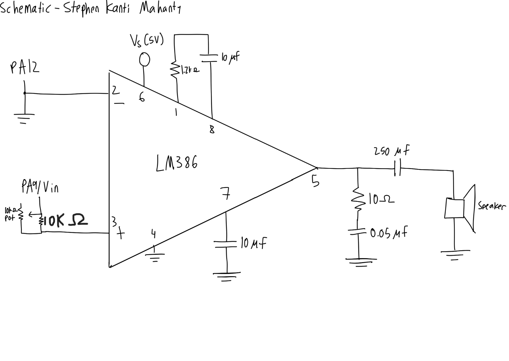

<!-- Recovered from published HTML at commit 74aecb388263b078a9a4d0da348c04b87e4c3259; original source formatting and unpublished content are unavailable. -->

::: {.callout-tip title="Annotated Report Template"}

The following is the lab report for lab 4 for Stephen Kanti Mahanty.

:::


## Introduction {#introduction}


::: {.callout-note title="Introduction"}

Using C code to make a digital speaker

:::


In this lab, a design was implemented on the MCU to demonstrate the ability of the speaker system to play Fur Elise by Beethoven as well as my own music. This required using a speaker system and an audio amplifier connected to the MCU, and learning how to read a datasheet to implement a timer and turn on a pin.


## Design and Testing Methodology {#design-and-testing-methodology}


::: {.callout-note title="Design and Testing Methodology"}

Explaining how I approached the design of this assignment from both a software and a hardware standpoint (as appropriate). Include how I tested the design.

:::


The MCU, an STM32, has a long datasheet which allows me to understand the product and use the required information to allow for sound to be generated via a speaker. For sound to be generated, a square wave must be an output of a pin and enter through an audio amplifier. To output this square wave, a timer (TIM6) was implemented on the STM32 and the datasheet was used to turn the pin on. After that point, the frequency and period were inputted and the square wave was generated by counting the amount of half-periods in the duration and turning on the pin at a given frequency. For rests, no square wave was generated.


To actually play on the speaker, an audio amplifier was connected. The connection was based off of the audio amplifier (LM836) datasheet and included a potentiometer to change volume. The potentiometer was connected in parallel with a resistor to make use of more parts of the potentiometer. The schematic also makes use of various capacitors and resistors to reduce noise and connect to the speaker well.


// TODO - UPDATE CALCULATIONS


The calculation for 200 Hz is below


<details>
<summary>Click to reveal calculations</summary>

$$
\text{Half Period Counts} =  \frac{1000000}{2 \cdot 220} ~ 2273 \text{ counts}
$$

 

$$
\text{Frequency} =  \frac{1000000}{2 \cdot 2273} ~ 219.9 \text{ Hz}
$$

</details>


The calculation for 1000 Hz is below


<details>
<summary>Click to reveal calculations</summary>

$$
\text{Half Period Counts} =  \frac{1000000}{2 \cdot 1000} ~ 500 \text{ counts}
$$

 

$$
\text{Frequency} =  \frac{1000000}{2 \cdot 500} ~ 1000 \text{ Hz}
$$

</details>


The calculations, as well as the rest of the calculations (which are in 1% error) are in this [Google Sheet](https://docs.google.com/spreadsheets/d/1leSXSZfpqYPtqx9dM8q6qqET1fS6uXde/edit?usp=sharing&ouid=107474147189031270673&rtpof=true&sd=true).


Only checking 220 Hz and 1000 Hz is not enough, as the error depends on rounding (which is why 1000 Hz is exact). The song contains 1319 Hz, which is outside this interval, which means we need to check more values.


Hardware was tested using physical displays, and was proven correct.


## Technical Documentation: {#technical-documentation}


::: {.callout-note title="Technical Documentation"}

Includes the link to a Git repository with the Verilog code and schematics of the circuits.

:::


The source code for the project can be found in the associated [Github repository](https://github.com/ENGR155/engr155-lab4/tree/main).


### Schematic {#schematic}

 



 

[Figure 1](#fig-schematic) shows the physical layout of the design. It shows all the inputs and the outputs as well as the audio amplifier connections.


## Results and Discussion {#results-and-discussion}


::: {.callout-note title="Results and Discussion"}

Did you accomplish all of the prescribed tasks? If not, what are the shortcomings? How might you address them given more time? As appropriate, how did the design perform (e.g., How fast/accurate/reliable was it?).

:::


I did accomplish all of the prescribed tasks. The design successfully played a song of my choice and was also able to play Fur Elise with the provided code under the provided specs. Given more time, I would have liked to implement a better audio system, since it felt like the speakers could only play 8-bit-style music and not have much variety in songs. I think adding more speakers and functionality could allow for a stronger sound system that also sounds better.


I do believe this lab was very confusing and hard to understand. The specs did not give much idea on how to work with the materials and the datasheet, and only a few tutorials, like the clock tutorial, helped me understand what to do and how to approach the lab. I do admit it took me a while to look through the datasheet and check for the specific pin configurations whereas the actual thinking portion of this lab was much easier to implement (it was just a string of functions that relied on a clock). I also do think we should be allowed to use AI or an online tool to automatically look up timer pinouts and register values, since I don’t see much meaningful skill by reading the datasheets; as it is, no interviewer would ask me how to read a datasheet. I believe it is useful for the first 10% of the work, but after that it becomes useless (it is useful to cross-check AI though).


## Conclusion {#conclusion}


::: {.callout-note title="Conclusion"}

Briefly summarize what was done and how it performed. Also note how many hours you spent working on the lab.

:::


The design successfully played audio based on a note array. It performed well and I don’t see it deviating from its intended performance much. I spent a total of 14 hours working on this lab.


## AI Prototype Summary {#ai-prototype-summary}


I asked Le Chat Mistral. It gave out the following:


<details>
<summary>Click to reveal response</summary>

Timer options on the STM32L432KC

 

<table class="caption-top table">
<colgroup>
<col style="width: 20%">
<col style="width: 20%">
<col style="width: 20%">
<col style="width: 20%">
<col style="width: 20%">
</colgroup>
<thead>
<tr class="header">
<th>Timer</th>
<th>Bus</th>
<th>Width</th>
<th>Output channels</th>
<th>Notes</th>
</tr>
</thead>
<tbody>
<tr class="odd">
<td>TIM1</td>
<td>APB2</td>
<td>16-bit</td>
<td>4 (+ complementary)</td>
<td>Advanced/motor-control, overkill here</td>
</tr>
<tr class="even">
<td><strong>TIM2</strong></td>
<td>APB1</td>
<td><strong>32-bit</strong></td>
<td><strong>4 (CH1–CH4)</strong></td>
<td>Best choice (see below)</td>
</tr>
<tr class="odd">
<td>TIM6 / TIM7</td>
<td>APB1</td>
<td>16-bit</td>
<td><strong>None</strong></td>
<td>DAC-trigger only — <strong>cannot drive a pin</strong></td>
</tr>
<tr class="even">
<td>TIM16 / TIM17</td>
<td>APB2</td>
<td>16-bit</td>
<td>1 each</td>
<td>Workable, but limited AF pin mappings</td>
</tr>
<tr class="odd">
<td>LPTIM1 / LPTIM2</td>
<td>—</td>
<td>16-bit</td>
<td>1 each</td>
<td>Useful only if you must run in low-power modes</td>
</tr>
</tbody>
</table>

 

Recommendation: TIM2

 

TIM2 is the best fit for 220 Hz–1 kHz:

 

- It has four output-compare channels that map directly to GPIO pins via AF1: **PA0 = TIM2\_CH1, PA1 = TIM2\_CH2, PA2 = TIM2\_CH3, PA3 = TIM2\_CH4** — all present on the LQFP32 package. Note PA2/PA3 are USART2 TX/RX on the Nucleo-32, so **PA0 or PA1 is the cleanest choice** if you’re using the virtual COM port.
- 32-bit auto-reload gives you enormous resolution at these low frequencies.
- It’s a general-purpose timer, so the pins are freed for other uses when idle.

 

TIM6/TIM7 are the trap: they generate update events for the DAC but have no output channel routed to any pin.

 

Formulae

 

**Timer clock.** The timer clock is `PCLK1` if the APB1 prescaler is 1, or `2 × PCLK1` if it’s greater than 1. In the standard 80 MHz configuration (SYSCLK 80 MHz, APB1 div 2 → PCLK1 = 40 MHz), **TIM2 gets 80 MHz**. Check your `SystemClock_Config()`.

 

**Output frequency (PWM mode):**

 

$$
f_{out} = \frac{f_{TIM}}{(PSC+1)\cdot(ARR+1)}
$$

 

**Duty cycle:** $D = \frac{CCRx}{ARR+1}$ (for 50% square wave, CCRx = (ARR+1)/2)

 

**Toggle mode** (if you use “toggle on compare” instead): $f_{out} = \dfrac{f_{TIM}}{2\,(PSC+1)\,(ARR+1)}$

 

**Sizing example.** With $f_{TIM}$ = 80 MHz, pick PSC = 79 → 1 MHz tick, so ARR = 10⁶/f − 1:

 

<table class="caption-top table">
<thead>
<tr class="header">
<th>Target</th>
<th>ARR</th>
<th>Actual</th>
<th>Resolution</th>
</tr>
</thead>
<tbody>
<tr class="odd">
<td>1 kHz</td>
<td>999</td>
<td>1000.00 Hz</td>
<td>0.1%</td>
</tr>
<tr class="even">
<td>220 Hz</td>
<td>4545</td>
<td>219.98 Hz</td>
<td>~0.022%</td>
</tr>
</tbody>
</table>

 

The 32-bit ARR means you could even use PSC = 0 and still fit 80 MHz/220 Hz ≈ 363,636 counts with room to spare — resolution is never a problem in this range.

 

Registers to set

 

1. **Clock enable** — `RCC->APB1ENR1` bit 0 (`TIM2EN`)
2. **GPIO (PA0 as example)** — `GPIOA->MODER`: PA0 = `10` (alternate function); `GPIOA->AFRL`: AF0 field = `0001` (AF1 = TIM2\_CH1); `GPIOA->OSPEEDR` as desired
3. **Time base** — `TIM2->PSC` and `TIM2->ARR`; `TIM2->CR1` bit 7 (`ARPE`, preload ARR)
4. **Force an update event** — `TIM2->EGR` bit 0 (`UG`): PSC only latches on the next update event, so do this after writing PSC
5. **Channel config (PWM mode 1)** — `TIM2->CCMR1`: `OC1M` (bits 6:4) = `110`, `OC1PE` (bit 3) = 1; `TIM2->CCR1` = duty; `TIM2->CCER` bit 0 (`CC1E`) = 1 to route the channel to the pin
6. **Start** — `TIM2->CR1` bit 0 (`CEN`)
7. Optional: `TIM2->DIER` bit 0 (`UIE`) plus NVIC if you want an interrupt each period

 

Minimal bare-metal example (PA0, 220 Hz, 50% duty, assumed 80 MHz timer clock):

 

```c
RCC->APB1ENR1 |= RCC_APB1ENR1_TIM2EN;
RCC->AHB2ENR  |= RCC_AHB2ENR_GPIOAEN;

GPIOA->MODER = (GPIOA->MODER & ~3u) | (2u << 0);   // PA0 = AF
GPIOA->AFRL  = (GPIOA->AFRL  & ~0xFu) | (1u << 0); // PA0 = AF1 (TIM2_CH1)

TIM2->PSC = 79;                 // 80 MHz / 80 = 1 MHz tick
TIM2->ARR = 4545;               // 1 MHz / (4545+1) ≈ 220 Hz
TIM2->CCR1 = (4545 + 1) / 2;    // 50% duty
TIM2->EGR  = TIM_EGR_UG;        // latch PSC immediately
TIM2->CCMR1 = (6 << 4) | TIM_CCMR1_OC1PE;   // PWM mode 1, preload
TIM2->CCER  = TIM_CCER_CC1E;                // enable output on pin
TIM2->CR1  |= TIM_CR1_ARPE | TIM_CR1_CEN;   // enable
```

 

Change only `ARR`/`CCR1` to sweep the 220 Hz–1 kHz range. Two gotchas: keep `ARPE` set so ARR updates take effect at the end of the period (glitch-free), and remember the doubled APB1 timer clock when computing PSC — if your APB1 prescaler is 1, the timer clock is 40 MHz, not 80 MHz.

</details>


I think the quality of the output worked well since I was able to see the specific timers to turn on and the pathways to turn on the timers and the specific registers to turn on. The quality of the output also was improved due to tables and comparisons to help me understand each design choice. The speed is much better than the reference manual, since it automatically checks and scans the reference manual and reads the datasheet for me, which is really nice. It does point me in the right direction since it gives me the tool immediately whereas Ctrl-F is a lot harder to check specific sections (as the reference manual is so big that I can’t search everything at once).


The LLM did generate code for me, but it was not complete. My setup actually has drivers and is complete, which is better and actually turns on. The LLM’s response is less structured but also tells me what to turn on and how, so it is a bit easier that way for someone who might not know anything about C. The LLM’s explanation is better than my reasoning, as I chose my timer as it was simple and easy to implement, whereas the LLM chose its timer for its abilities. The document search is better and I think the LLM is better at this than doing HDL since most of this lab was reading documents.


I would use AI in the future for these sorts of readings as they improve my speed and efficiency, and I would likely get fired if I didn’t lol.
