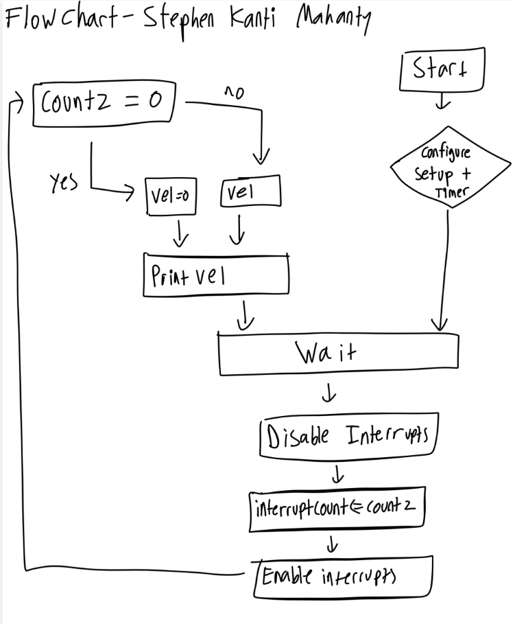
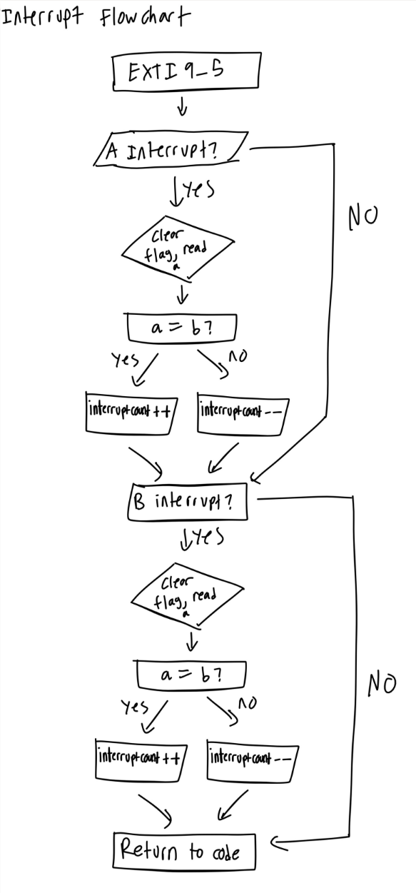
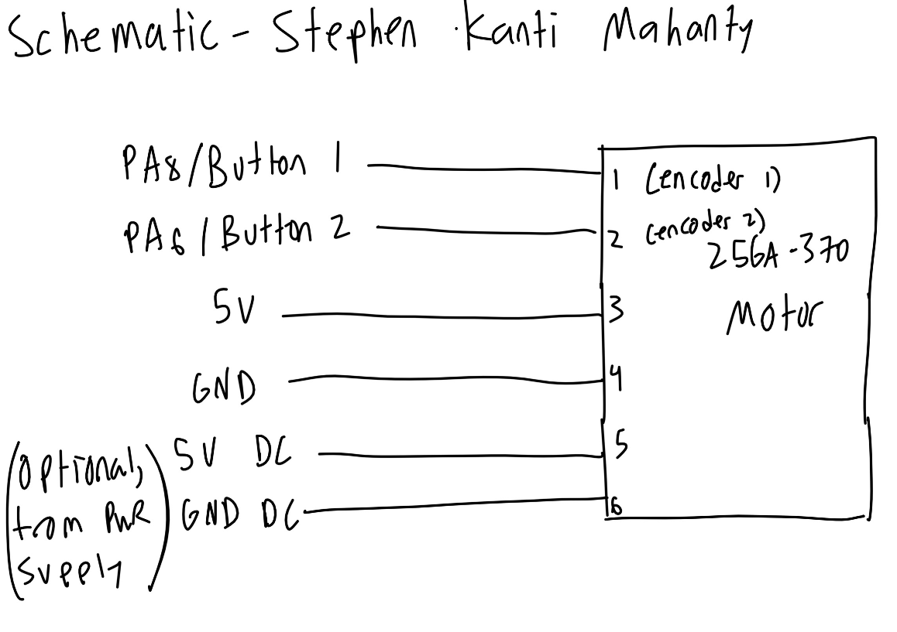

::: {.callout-tip title="Annotated Report Template"}
The following is the lab report for lab 5 for Stephen Kanti Mahanty.
:::

## Introduction

::: {.callout-note title="Introduction"}
Using interrupts to determine the speed of a motor.
:::

In this lab, a design was implemented on the MCU to demonstrate the use of interrupts to determine the speed of a motor. The interrupts were chosen from the datasheet and allowed for precise timing and accurate measurement of the motor's speed. This timing used encoders to count the number of pulses generated by the motor over a given period, which was then used to calculate the motor's speed.

## Design and Testing Methodology

::: {.callout-note title="Design and Testing Methodology"}
Explaining how I approached the design of this assignment from both a software and a hardware standpoint (as appropriate). Include how I tested the design.
:::

Most the design required reading the datasheets to understand how interrupts work. Unlike polling, interrupts allow the MCU to respond immediately to events, such as changes in the motor's speed, without continuously checking the status of the motor. This approach improves efficiency and ensures more accurate speed measurement. These interrupts were configured to trigger at specific intervals, allowing the system to accurately count the number of pulses generated by the motor and calculate its speed accordingly.

From software, I wrote code that detects whether the interrupts have been triggered and counts the number of interrupts over a given period of 800 ms. This count is then used to calculate the motor's speed based on the known relationship between the number of pulses and the motor's rotation. I made sure to use a volatile variable to store the interrupt count to ensure accurate measurement even if the interrupt occurs at any time. I also used a separate function to track the speed of the motor and print it out using a printf statement. This calculation allows for real-time monitoring and accurate determination of the motor's speed.

From the hardware standpoint, the motor was connected to the MCU's breadboard adapter. The pins that connect directly to the MCU were chosen because they are 5V-tolerant. The motor's encoder was also connected to the appropriate pins on the MCU to allow for accurate pulse counting. Care was taken to ensure that all connections were secure and that the wiring minimized noise and interference, which could affect the accuracy of the speed measurement.

To calculate the speed, a formula accepted the count variable as well as the number of counts per revolution (fixed constant) and the time interval over which the count was measured. The formula used was:

$$
\text{Speed (RPS)} = \frac{\text{Count}}{\text{4*(Counts per Revolution)} \times \text{0.8 ms}}
$$

Using interrupts is better than trying to manually poll at high speeds. At high speeds, polling would need to have a very high frequency to make sure it can catch interrupts. Also, polling can lead to missed events if the MCU is busy with other tasks, whereas interrupts ensure that the MCU responds immediately to changes in the motor's speed. A downside with using interrupts is that they can be more complex to implement and debug compared to simple polling, and they may introduce latency if the MCU is handling other interrupts at the same time.

A motor spinning at 2.5 rev/s generates approximately 4,000 edges per second, or one edge every 245 μs. Polling must check both channels faster than this interval to be reliable. This would be very fast and a loop polling every 1 ms can miss several edges. At 10 rev/s, the available interval decreases to about 61 μs. This would require an even faster poll. Interrupts also allow encoder edges to be processed while the main loop does calculations and prints, making it more reliable. However, interrupt handling and any periods with interrupts disabled must be short enough to capture each edge before the next arrives. 

## Technical Documentation:

::: {.callout-note title="Technical Documentation"}
Includes the link to a Git repository with the Verilog code, a block diagram of the design, and schematics of the circuits.
:::

The source code for the project can be found in the associated [Github repository](https://github.com/ENGR155/engr155-lab5/tree/main).

### Flow Charts

::: {#fig-main-flow}
<details>
<summary>Click to reveal schematic</summary>

</details>

Main flowchart.
:::

::: {#fig-interrupt-flow}
<details>
<summary>Click to reveal schematic</summary>

</details>

Interrupt flowchart.
:::

The flowcharts illustrate the main logic and interrupt handling of the design. They communicate through the volatile variable interruptcount. The interrupt handler increments or decrements this counter, and the main logic disables interrupts, copies the variable, resets the variable, and then enables interrupts again. The handler then returns back to where it was interrupted.

### Schematic

::: {#fig-schematic}
<details>
<summary>Click to reveal schematic</summary>

</details>

Schematic of the physical circuit.
:::

@fig-schematic shows the physical layout of the design. It shows logic gates and connections between all the inputs and outputs. For the big block in the middle describing the seven-segment display, the full logic code is below, but it is pretty messy so I have it below:

## Results and Discussion

::: {.callout-note title="Results and Discussion"}
Did you accomplish all of the prescribed tasks? If not, what are the shortcomings? How might you address them given more time? As appropriate, how did the design perform (e.g., How fast/accurate/reliable was it?).
:::

I did accomplish all of the prescribed tasks. The design successfully displayed the speed of the motor using interrupts. I do believe that with more time, I could have further optimized the accuracy and reliability of the speed measurement. I could also work with detecting more intricate details of other systems using interrupts rather than polling, but overall this was an interesting lab.

I do prefer this lab to lab 4, as there is much less datasheet reading as compared to the previous lab. I found it more useful to not have to deal with datasheets and instead focus on understanding the core concepts and implementation details of the design.


## Conclusion

::: {.callout-note title="Conclusion"}
Briefly summarize what was done and how it performed. Also note how many hours you spent working on the lab.
:::

The design successfully displayed the speed of the motor using interrupts. I spent a total of fifteen hours working on this lab.

## AI Prototype Summary

I asked Google's Gemini. It gave out the following:

<details>
<summary>Click to reveal AI Summary</summary>

```
To interface a quadrature encoder with the STM32L432KC, connect **Channel A** to pin **PA0** and **Channel B** to pin **PA1**.

These pins connect directly to **TIM2** (Channel 1 and Channel 2), which is a **32-bit hardware timer**. On STM32 microcontrollers, using the timer's built-in **Hardware Encoder Mode** is vastly superior to software GPIO interrupts because the hardware decodes phases, tracks direction, and increments the counter in hardware without consuming CPU cycles or missing high-speed encoder pulses.

---

### Recommended Pin Mapping (Nucleo-L432KC)

| Encoder Line | STM32 Pin | Peripheral Mapping | Board Header Label |
| --- | --- | --- | --- |
| **Channel A** | **PA0** | `TIM2_CH1` / `EXTI0` | A0 |
| **Channel B** | **PA1** | `TIM2_CH2` / `EXTI1` | A1 |
| **Index / Z (Optional)** | **PA2** | `EXTI2` | A2 |
| **VCC / GND** | 3.3V / GND | Power | 3V3 / GND |

*Note: Enable internal pull-up resistors (`GPIO_PULLUP`) unless your encoder board already includes hardware pull-up resistors.*

---

### Option 1: Hardware Timer Encoder Mode (Recommended)

In hardware mode, `TIM2->CNT` automatically holds the current position. You only need an interrupt handler if you want to catch 32-bit counter overflow/underflow events or track rotations.

#### 1. Hardware Initialization (STM32 HAL / CMSIS)

```c
#include "stm32l4xx_hal.h"

TIM_HandleTypeDef htim2;

void Encoder_TIM2_Init(void)
{
    __HAL_RCC_GPIOA_CLK_ENABLE();
    __HAL_RCC_TIM2_CLK_ENABLE();

    // 1. Configure GPIO Pins PA0 (TIM2_CH1) and PA1 (TIM2_CH2)
    GPIO_InitTypeDef GPIO_InitStruct = {0};
    GPIO_InitStruct.Pin = GPIO_PIN_0 | GPIO_PIN_1;
    GPIO_InitStruct.Mode = GPIO_MODE_AF_PP;
    GPIO_InitStruct.Pull = GPIO_PULLUP;
    GPIO_InitStruct.Speed = GPIO_SPEED_FREQ_HIGH;
    GPIO_InitStruct.Alternate = GPIO_AF1_TIM2;
    HAL_GPIO_Init(GPIOA, &GPIO_InitStruct);

    // 2. Configure Timer in Encoder Interface Mode
    TIM_Encoder_InitTypeDef sConfig = {0};

    htim2.Instance = TIM2;
    htim2.Init.Prescaler = 0;
    htim2.Init.CounterMode = TIM_COUNTERMODE_UP;
    htim2.Init.Period = 0xFFFFFFFF; // 32-bit max count
    htim2.Init.ClockDivision = TIM_CLOCKDIVISION_DIV1;
    htim2.Init.AutoReloadPreload = TIM_AUTORELOAD_PRELOAD_DISABLE;

    // TIM_ENCODERMODE_TI12 counts on both edges of TI1 and TI2 (4x Resolution)
    sConfig.EncoderMode = TIM_ENCODERMODE_TI12; 
    
    // Channel 1 setup with built-in noise filter (0-15)
    sConfig.IC1Polarity = TIM_ICPOLARITY_RISING;
    sConfig.IC1Selection = TIM_ICSELECTION_DIRECT_TI;
    sConfig.IC1Prescaler = TIM_ICPSC_DIV1;
    sConfig.IC1Filter = 6; 

    // Channel 2 setup
    sConfig.IC2Polarity = TIM_ICPOLARITY_RISING;
    sConfig.IC2Selection = TIM_ICSELECTION_DIRECT_TI;
    sConfig.IC2Prescaler = TIM_ICPSC_DIV1;
    sConfig.IC2Filter = 6;

    HAL_TIM_Encoder_Init(&htim2, &sConfig);

    // 3. Enable NVIC Timer Update Interrupt for Overflow/Underflow
    HAL_NVIC_SetPriority(TIM2_IRQn, 0, 0);
    HAL_NVIC_EnableIRQ(TIM2_IRQn);

    // Enable Timer update interrupt & start encoder
    __HAL_TIM_ENABLE_IT(&htim2, TIM_IT_UPDATE);
    HAL_TIM_Encoder_Start(&htim2, TIM_CHANNEL_ALL);
}

```


```c
volatile int32_t overflow_count = 0;

// TIM2 Interrupt Handler for Overflow/Underflow
void TIM2_IRQHandler(void)
{
    if (__HAL_TIM_GET_FLAG(&htim2, TIM_FLAG_UPDATE) != RESET) {
        if (__HAL_TIM_GET_IT_SOURCE(&htim2, TIM_IT_UPDATE) != RESET) {
            __HAL_TIM_CLEAR_IT(&htim2, TIM_IT_UPDATE);

            // Check counting direction at overflow
            if (__HAL_TIM_IS_TIM_COUNTING_DOWN(&htim2)) {
                overflow_count--;
            } else {
                overflow_count++;
            }
        }
    }
}

// Read absolute position anywhere in your code
int32_t Get_Encoder_Position(void)
{
    return (int32_t)__HAL_TIM_GET_COUNTER(&htim2);
}

// Read current movement direction (0 = Forward / Clockwise, 1 = Reverse / Counter-Clockwise)
uint8_t Get_Encoder_Direction(void)
{
    return __HAL_TIM_IS_TIM_COUNTING_DOWN(&htim2);
}

```

---


If hardware timer channels are unavailable or you must decode manually using software GPIO interrupts, set up Channel A (**PA0**) as an EXTI line configured for **both rising and falling edges**, and Channel B (**PA1**) as a standard GPIO Input.


```c
void Encoder_EXTI_Init(void)
{
    __HAL_RCC_GPIOA_CLK_ENABLE();

    GPIO_InitTypeDef GPIO_InitStruct = {0};

    // PA0: External Interrupt on Rising and Falling Edges
    GPIO_InitStruct.Pin = GPIO_PIN_0;
    GPIO_InitStruct.Mode = GPIO_MODE_IT_RISING_FALLING;
    GPIO_InitStruct.Pull = GPIO_PULLUP;
    HAL_GPIO_Init(GPIOA, &GPIO_InitStruct);

    // PA1: Regular Input
    GPIO_InitStruct.Pin = GPIO_PIN_1;
    GPIO_InitStruct.Mode = GPIO_MODE_INPUT;
    GPIO_InitStruct.Pull = GPIO_PULLUP;
    HAL_GPIO_Init(GPIOA, &GPIO_InitStruct);

    // Enable EXTI Line 0 Interrupt
    HAL_NVIC_SetPriority(EXTI0_IRQn, 1, 0);
    HAL_NVIC_EnableIRQ(EXTI0_IRQn);
}

```

```c
volatile int32_t encoder_position = 0;

void EXTI0_IRQHandler(void)
{
    // Check if EXTI line 0 pending bit is set
    if (__HAL_GPIO_EXTI_GET_IT(GPIO_PIN_0) != RESET) {
        __HAL_GPIO_EXTI_CLEAR_IT(GPIO_PIN_0);

        // Read current state of both channel pins
        GPIO_PinState pinA = HAL_GPIO_ReadPin(GPIOA, GPIO_PIN_0);
        GPIO_PinState pinB = HAL_GPIO_ReadPin(GPIOA, GPIO_PIN_1);

        // Quadrature state logic on Channel A transition
        if (pinA != pinB) {
            encoder_position++;  // Clockwise step
        } else {
            encoder_position--;  // Counter-clockwise step
        }
    }
}

```

</details>

I think the quality of the output from the LLM was quite good. It provided well-structured and readable code, and the explanations were clear and easy to understand. The code generated by the LLM was functional and followed best practices for handling encoder signals using both hardware timers and software GPIO interrupts. It was very similar to my own setup, and I was able to understand all of this after doing my own work, since the code and headers were consistent with that of the tutorial repository.

The LLM generated code for me, and the code was roughly similar to what I would have written myself, with some minor differences in structure and comments. It was solid and I was able to understand it. The code also included header files and library files, which were useful for making sure it could be fully simulated and ran. The LLM works as a sounding board since I can bounce back ideas from the LLM and see how they would be implemented. I could also see the LLM being very useful for reading datasheets and telling me how to implement each pin properly.